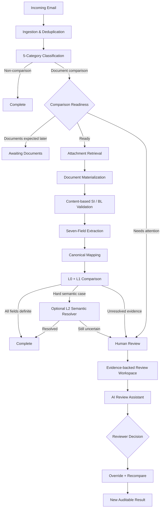
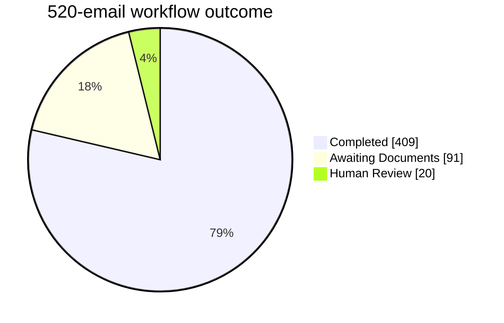

<div align="center">

# 🚢 HolyShip

### Multi-stage AI-assisted shipping document verification — from inbox to trusted SI–BL comparison.

**Team Name:** NJHL

**Team:** Wong Jia Hui · Bong Zi Shan · Lee Mei Shuet · Christ Ting Shin Ling · Gan Rui En

[🌐 Dashboard](https://holyship.onrender.com/) · [⚙️ Backend API](https://holyship-backend.onrender.com) · [📘 API Docs](https://holyship-backend.onrender.com/docs) · [📑 Presentation Slides](https://canva.link/kflchdm6qu1pslv) · [🎥 Demo Video]([https://youtu.be/mnfbrDJyGaQ) 

<br>

> **Shipping document verification should not depend on one black-box AI answer.**
>
> HolyShip verifies in stages, preserves the evidence, and sends only genuine uncertainty to a human reviewer.

<br>

**Classify → Validate → Extract → Normalize → Compare → Review only when needed.**

<br>

**Latest verified snapshot:** 520 emails evaluated · 409 completed · 91 awaiting documents · 20 Human Review cases · 46 confirmed mismatches · 0 failed

</div>

---

HolyShip is an end-to-end workflow for shipping operations teams. It reads incoming emails, works out what the sender is asking for, checks whether the required documents are ready, validates the Shipping Instruction (SI) and Bill of Lading (BL) attachments, extracts seven key fields, compares them, and sends only the cases that still need judgment to Human Review.

The project uses multi-stage verification rather than one large model call. Classification, readiness, document validation, extraction, normalization, comparison, review, and re-comparison are separate steps, so it is always possible to see where a case stopped, why a mismatch was reported, and which evidence was used.

LLMs are used only where they add value: optional hard semantic cases and the reviewer assistant. The deterministic pipeline remains authoritative for the main SI–BL comparison, and a human approves every review change.

> **HolyShip principle:** Verify in stages. Automate what is certain. Wait when documents are genuinely pending. Escalate only what still needs judgment.

---

# Why HolyShip Stands Out

## 1. Multi-stage verification, not a black-box answer

HolyShip does not jump straight from an email to “match” or “mismatch”.

```text
Incoming Email
    ↓
Intent Classification
    ↓
Comparison Readiness
    ↓
Attachment Retrieval
    ↓
Document Type & SI/BL Validation
    ↓
Seven-Field Extraction
    ↓
Canonical Mapping
    ↓
L0 Universal Normalization
    ↓
L1 Field-Specific Normalization
    ↓
Optional L2 Semantic Resolution
    ↓
SI ↔ BL Comparison
    ↓
Complete / Wait / Human Review
```

Each stage has a clear purpose and a clear failure or escalation path.

That matters in shipping operations because a wrong “MATCH” can hide a real document discrepancy, while a wrong “MISMATCH” can create unnecessary manual work or shipment delay.

---

## 2. MATCH, MISMATCH, and UNRESOLVED are different outcomes

Every canonical field ends in one of three states:

- `MATCH` — the values are confidently equivalent
- `MISMATCH` — the values are confidently different
- `UNRESOLVED` — there is not enough evidence to decide safely

A confirmed mismatch is **not automatically a Human Review case**.

If all seven fields are definite, HolyShip completes the comparison and reports the mismatch directly.

```text
6 MATCH + 1 MISMATCH + 0 UNRESOLVED
→ COMPLETED
```

Human Review is reserved for uncertainty and document exceptions that actually need a person.

---

## 3. Content-based document validation

HolyShip does not trust filenames alone.

A file named `BL.pdf` is not automatically accepted as a Bill of Lading. The system inspects the document content and validates the SI/BL role before extraction and comparison.

This allows HolyShip to distinguish between:

- missing required documents
- wrong document type
- corrupted files
- truly unreadable documents
- ambiguous document roles
- multiple candidate documents

So the system can explain *why* a comparison cannot continue instead of returning a generic error.

---

## 4. Waiting is not the same as an exception

HolyShip treats operational waiting as its own state.

```text
"Draft BL will follow later."
→ AWAITING_DOCUMENTS
```

but:

```text
"Please compare the attached SI and BL."
BL is missing
→ MISSING_REQUIRED_ATTACHMENT
→ Human Review
```

This keeps normal waiting out of the Human Review queue while still surfacing missing-document problems that require action.

---

## 5. Human Review preserves the original evidence

When a reviewer corrects a field, HolyShip does not overwrite the original extraction.

```text
Original Extraction
        ↓
Human Review Override
        ↓
Effective Reviewed Value
        ↓
Resolve & Recompare
        ↓
New Comparison Version
```

The original machine output, the reviewer’s decision, and the new comparison remain traceable.

---

## 6. AI is used where it actually helps

HolyShip does use AI/LLMs — but selectively.

There are two main AI use cases:

1. **Optional L2 semantic resolution**  
   For difficult residual cases where deterministic L0/L1 rules intentionally stop at `UNRESOLVED`.

2. **AI Review Assistant**  
   Inside Human Review, where an LLM can explain why a case is blocked, summarize evidence, and suggest a structured field correction.

The core verification pipeline remains functional without AI. AI adds semantic help around the difficult cases instead of becoming the only source of truth.

---

## 7. Dashboard + Outlook, one workflow

HolyShip supports two connected experiences:

- **Web Dashboard** — operational overview, email queue, discrepancies, Human Review, analytics, evidence, and re-comparison
- **Outlook Add-in** — compact status for the email the user is already reading, with a deep link into the full case

The same workflow semantics are shared across both surfaces.

---


# Purpose

HolyShip aims to reduce repetitive manual SI–BL verification while keeping shipping-document decisions traceable and reliable. Instead of replacing human judgment with a black-box AI result, it automates deterministic checks, preserves source evidence, and escalates only cases that genuinely require human review.

---
# 1. The Problem

Shipping teams receive mixed inbox traffic every day:

- Shipping Instructions
- draft Bills of Lading
- invoice questions
- document-check requests
- operational messages
- spam

For a single SI–BL verification request, staff may need to:

1. understand the actual request in the email
2. check whether the required documents have arrived
3. identify which attachment is the SI and which is the BL
4. extract matching shipment fields from different layouts
5. normalize harmless formatting differences
6. identify real discrepancies
7. decide whether uncertain values need human attention
8. keep a record of what was checked and changed

HolyShip turns those steps into one traceable workflow.

---

# 2. End-to-End Workflow



---

# 3. Email Ingestion

HolyShip ingests messages through a source abstraction so the verification pipeline does not depend on where an email came from.

Supported source patterns include:

- static competition/demo bundle
- HTTP source
- incoming API ingestion
- Microsoft Graph adapter integration

Each message is normalized into a common internal structure and assigned a content hash for safe deduplication and reprocessing.

This allows the same downstream workflow to handle an initial backlog sync, repeated sync, or future live mailbox ingestion without changing comparison logic.

---

# 4. Five-Category Classification

Every email is classified into one of five operational categories:

- `document_comparison`
- `new_si_request`
- `invoice_query`
- `general_message`
- `spam`

Classification uses weighted evidence from:

- body
- subject
- attachment metadata

The email body receives the strongest weight because it usually contains the actual requested action.

HolyShip uses two stages:

### Stage 1 — Fast path

Clear emails are classified immediately when confidence and separation thresholds are met.

### Stage 2 — Conflict resolution

Mixed or conflicting signals receive a second pass with stronger emphasis on body intent.

If the evidence is still insufficient, the workflow keeps the uncertainty visible rather than forcing a confident-looking answer.

---

# 5. Comparison Readiness

Only `document_comparison` emails proceed into SI–BL verification.

Readiness is stored explicitly as:

- `READY_FOR_COMPARISON`
- `AWAITING_DOCUMENTS`
- `UNRESOLVED`

This lets HolyShip distinguish a normal waiting state from an actual exception.

Example:

```text
"We will send the draft BL later."
→ AWAITING_DOCUMENTS
```

while:

```text
"Please compare the attached SI and BL."
BL is absent
→ MISSING_REQUIRED_ATTACHMENT
→ Human Review
```

---

# 6. Attachment Retrieval and Document Validation

Attachments are retrieved only when the workflow is ready to proceed.

This avoids unnecessary document parsing for non-comparison emails and emails that are still waiting on a required document.

HolyShip then validates document roles from content rather than filename alone.

Typical document-level reasons include:

- `MISSING_REQUIRED_ATTACHMENT`
- `WRONG_DOCUMENT_TYPE`
- `CORRUPTED_ATTACHMENT`
- `UNREADABLE_ATTACHMENT`
- `MULTIPLE_CANDIDATES`
- `DOCUMENT_ROLE_UNRESOLVED`

A wrong document, missing document, unreadable scan, and infrastructure failure are treated as different problems.

---

# 7. Structured Extraction

HolyShip extracts seven canonical shipping fields.

| Field | Purpose |
| --- | --- |
| `shipper` | Shipping party / exporter |
| `consignee` | Receiving party |
| `notify_party` | Notify party details |
| `port_of_loading` | Origin port |
| `port_of_discharge` | Destination port |
| `container_count` | Number of containers |
| `gross_weight_kg` | Gross shipment weight |

The **SI is treated as the reference document**, and the BL is checked against it.

For every field, HolyShip keeps evidence such as:

- raw label
- raw value
- canonical value
- confidence
- document/source provenance

Supported readers include:

- TXT / CSV
- PDF
- DOCX
- XLSX
- Tesseract OCR for scanned PDFs/images

---

# 8. Layered Comparison Architecture

HolyShip does not compare raw strings directly.

## L0 — Universal normalization

L0 removes harmless formatting differences such as:

- Unicode variation
- letter case
- repeated whitespace
- safe punctuation differences

## L1 — Field-specific normalization

Each field has rules that make sense for its data type.

### Container count

```text
3
03
3 containers
3 x 40HC
```

can be normalized consistently when the meaning is unambiguous.

### Gross weight

```text
22,000 KG
22000 kg
22 000 KGS
```

can be converted into a comparable numeric form.

### Ports

Ports use normalized formatting and controlled alias handling.

### Parties

Shipper, consignee, and notify-party values use conservative entity normalization so formatting noise can be removed without merging genuinely different companies.

---

## Optional L2 — Semantic resolution

Some cases are difficult to resolve with deterministic rules alone.

When enabled, the L2 resolver can use an LLM/provider to evaluate carefully selected unresolved fields.

L2 is deliberately optional:

```text
L0/L1 can run independently
L2 only sees residual difficult cases
L2 does not overwrite raw extraction
L2 does not replace Human Review
```

This gives HolyShip a place to use semantic reasoning without making every comparison dependent on an external model.

---

# 9. Comparison Outcomes

The final field-level outcomes are:

```text
MATCH
MISMATCH
UNRESOLVED
```

### Completed

All seven fields are definite.

Examples:

```text
7 MATCH
→ COMPLETED
```

or:

```text
6 MATCH + 1 MISMATCH
+ 0 UNRESOLVED
→ COMPLETED
```

### Waiting for Documents

The sender has clearly indicated that the required document will arrive later.

### Human Review

A business/document exception still requires human action.

### Processing Failed

A technical problem should be retried or reprocessed instead of being treated as a business-review case.

---

# 10. Human Review

Human Review is used for issues a person can meaningfully resolve.

Typical reasons include:

- `COMPARISON_UNRESOLVED`
- `MISSING_REQUIRED_ATTACHMENT`
- `WRONG_DOCUMENT_TYPE`
- `UNREADABLE_ATTACHMENT`
- `CORRUPTED_ATTACHMENT`
- `MULTIPLE_CANDIDATES`
- `DOCUMENT_ROLE_UNRESOLVED`

## Active Reviews

The Active queue contains current actionable work:

```text
case_origin = ACTIVE
status = OPEN or IN_REVIEW
```

Reviewers can:

- inspect email and document evidence
- inspect affected fields
- claim a case
- compare Original / Reviewed / Effective values
- add field-level overrides
- Resolve & Recompare
- inspect audit history

## History

Resolved, dismissed, and preserved legacy records live in History rather than the active queue.

This keeps current work focused without losing traceability.

---

# 11. AI Review Assistant

The AI Review Assistant sits inside Human Review and is designed for shipping-document review rather than open-ended chat.

A reviewer can ask:

- Why does this case need review?
- Which field should I inspect first?
- Where did this value come from?
- Why is this port unresolved?
- Summarize the SI–BL differences.
- Suggest a correction for the BL gross weight.

The assistant responds in structured modes:

- `EXPLANATION_ONLY`
- `ACTIONABLE_SUGGESTION`
- `INSUFFICIENT_EVIDENCE`

Example flow:

```text
Reviewer asks a question
        ↓
LLM reads the current case evidence
        ↓
Explanation or structured suggestion
        ↓
Reviewer Accepts / Edits / Dismisses
        ↓
Approved override is stored
        ↓
Resolve & Recompare
```

An actionable suggestion is never applied silently.

Example:

```json
{
  "mode": "ACTIONABLE_SUGGESTION",
  "suggestion": {
    "action": "FIELD_OVERRIDE",
    "document_side": "BL",
    "field": "gross_weight_kg",
    "current_value": "22,O00 KG",
    "suggested_value": "22000",
    "confidence": 0.94,
    "reason": "Possible OCR O/0 character confusion"
  }
}
```

The Review Assistant is provider-based and can be configured with an LLM provider such as Gemini.

---

# 12. Where AI / LLM Is Used

HolyShip intentionally does not put an LLM in every step.

| Area | Approach |
| --- | --- |
| Email classification | deterministic weighted evidence |
| Readiness | deterministic workflow rules |
| Document role validation | content-based validation |
| Extraction | structured readers + OCR |
| L0/L1 comparison | deterministic |
| Hard residual semantic cases | optional L2 LLM resolver |
| Human Review explanation | LLM-assisted |
| Human Review suggestions | LLM-assisted + human-approved |

This is one of the main design choices in HolyShip: **use deterministic rules where repeatability matters, and use AI where semantic reasoning adds value.**

---

# 13. OCR and Scanned Documents

Scanned PDFs and image-based documents are handled through Tesseract OCR.

```text
Scanned document
      ↓
OCR
      ↓
Structured extraction
      ↓
Normal comparison pipeline
```

HolyShip also separates two very different situations:

```text
OCR runtime unavailable
→ technical processing issue
→ Retry / Reprocess
```

versus:

```text
OCR available, but document still cannot be read reliably
→ UNREADABLE_ATTACHMENT
→ Human Review
```

This avoids blaming the document when the real problem is infrastructure.

---

# 14. Web Dashboard

The Dashboard is the main operations workspace.

## Overview

The Overview shows:

- total emails
- completed workflows
- emails with mismatch
- open Human Review cases
- Awaiting Documents
- failed processing
- currently processing items

## Email Queue

Users can browse processed emails and filter by workflow state.

## Discrepancies

Confirmed mismatch cases are surfaced separately from unresolved review cases.

## Human Review

The Human Review workspace includes:

- Active Reviews / History
- search and filters
- reviewer assignment
- reason and priority
- source evidence
- affected fields
- Original / Reviewed / Effective values
- audit timeline
- AI Review Assistant
- Resolve & Recompare

---

# 15. Outlook Add-in

HolyShip also provides an Outlook companion for the email currently open in the user’s inbox.

User-facing states include:

- Not in HolyShip
- Processing
- Completed
- Waiting for Documents
- Needs Review
- Processing Failed

For document-comparison emails, the Add-in can show:

- Match / Mismatch / Unresolved totals
- review reason
- affected fields
- priority
- reviewer state
- a deep link to the full Dashboard case

This creates a continuous workflow from **email → verification → review**.

### Outlook Demo Account

Use this dedicated demo account for the Outlook Add-in presentation:

| Credential | Demo value |
|---|---|
| Username | `captain.holyship@outlook.com` |
| Password | `captain12` |

These credentials are for the demo account only and have also been submitted through the project Google Form.

---

# 16. Human Review Analytics

HolyShip turns persisted review data into operational insight.

The analytics layer can surface:

- Open reviews
- In Review
- Resolved
- Dismissed
- Resolved Today
- Average Open Age
- Priority Distribution
- Review Reason Distribution
- Most Reviewed Fields
- Most Corrected Fields

The same persisted review data powers both the workflow and the analytics.

---

# 17. User-Friendly Operational Language

Internal reason codes are mapped to wording that operations users can act on.

| Internal State | User-Facing Meaning |
| --- | --- |
| `CLASSIFICATION_UNRESOLVED` | Email type unclear |
| `COMPARISON_UNRESOLVED` | One or more document fields could not be verified |
| `COMPARISON_MISMATCH` | The SI and BL contain different values |
| `DOCUMENT_ROLE_UNRESOLVED` | Could not confidently identify the SI or BL |
| `WRONG_DOCUMENT_TYPE` | The attached file is not the required document |
| `MISSING_REQUIRED_ATTACHMENT` | A required shipping document is missing |
| `UNREADABLE_ATTACHMENT` | The document could not be read reliably |
| `AWAITING_DOCUMENTS` | Waiting for required documents |
| `BLOCKED` | Needs attention before processing can continue |
| `FAILED` | Processing failed — retry required |

Technical failures are kept separate from business-facing document exceptions.

---

# 18. Architecture

```mermaid
flowchart LR

subgraph INPUT[Email Sources]
    STATIC[Static Bundle]
    HTTP[HTTP Source]
    INCOMING[Incoming API]
    GRAPH[Microsoft Graph]
end

subgraph WORKFLOW[Workflow Engine]
    SOURCE[EmailSource]
    SYNC[Sync Service]
    FSM[Processing State]
end

subgraph INTENT[Intent]
    S1[Stage 1 Classification]
    S2[Stage 2 Resolution]
    READY[Comparison Readiness]
end

subgraph DOCS[Document Processing]
    RETRIEVE[Attachment Retrieval]
    ROUTER[Document Router]
    READERS[TXT / PDF / DOCX / XLSX / OCR]
    ROLE[SI / BL Validation]
    EXTRACT[Seven-Field Extraction]
end

subgraph VERIFY[Verification]
    MAP[Canonical Mapping]
    L0[L0 Normalization]
    L1[L1 Field Rules]
    L2[Optional LLM Semantic Resolver]
    RESULT[Match / Mismatch / Unresolved]
end

subgraph REVIEW[Human Review]
    QUEUE[Active Review Queue]
    AI[AI Review Assistant]
    OVERRIDE[Field Override]
    RECOMPARE[Resolve & Recompare]
    HISTORY[Review History]
end

subgraph EXPERIENCE[User Experience]
    DASH[Web Dashboard]
    OUTLOOK[Outlook Add-in]
end

INPUT --> SOURCE --> SYNC --> FSM --> S1 --> S2 --> READY
READY --> RETRIEVE --> ROUTER --> READERS --> ROLE --> EXTRACT
EXTRACT --> MAP --> L0 --> L1 --> RESULT
RESULT --> L2
L2 --> RESULT
RESULT --> QUEUE
QUEUE --> AI
QUEUE --> OVERRIDE --> RECOMPARE --> RESULT
QUEUE --> HISTORY
RESULT --> DASH
QUEUE --> DASH
DASH --> OUTLOOK
```



---

# 19. Processing States

HolyShip models workflow progress explicitly:

```text
NEW
QUEUED
CLASSIFYING
CLASSIFIED
AWAITING_DOCUMENTS
RETRIEVING_ATTACHMENTS
EXTRACTING
COMPARING
COMPLETED
BLOCKED
FAILED
```

These states make it clear whether an email is:

- still processing
- waiting for a document
- complete
- blocked for Human Review
- failed for technical reasons

Important transitions are persisted as processing events for audit and debugging.

---

# 20. Data and Audit Model

HolyShip stores workflow state in PostgreSQL using SQLAlchemy and Alembic migrations.

Main data areas include:

| Area | Examples |
| --- | --- |
| Ingestion | email messages, attachments, processing events |
| Classification | classification results |
| Documents | materialized documents, extraction records |
| Extraction | canonical extracted fields |
| Comparison | comparison results, field comparisons |
| Human Review | review cases, overrides, review events |
| AI | semantic resolutions, structured suggestions |

A key design choice is that reviewer overrides are stored separately from original extraction rows.

---

# 21. Technical Stack

| Layer | Technology |
| --- | --- |
| Backend | Python, FastAPI |
| Database | PostgreSQL |
| ORM | SQLAlchemy |
| Migrations | Alembic |
| Dashboard | React, TypeScript, Vite |
| Outlook Add-in | React, TypeScript, Office.js |
| Document Readers | TXT, PDF, DOCX, XLSX |
| OCR | Tesseract |
| AI / LLM | optional L2 semantic resolver + AI Review Assistant |
| Testing | Pytest, Vitest |
| Deployment | Render |

---

# 22. API Highlights

```text
GET  /api/v1/summary
GET  /api/v1/emails
GET  /api/v1/emails/{email_id}

GET  /api/v1/human-review
GET  /api/v1/human-review/{review_id}
GET  /api/v1/human-review-analytics

POST /api/v1/human-review/{review_id}/claim
POST /api/v1/human-review/{review_id}/overrides
POST /api/v1/human-review/{review_id}/resolve
POST /api/v1/human-review/{review_id}/dismiss

POST /api/v1/human-review/{review_id}/ai/ask
POST /api/v1/human-review/{review_id}/ai/suggestions/{suggestion_id}/accept
POST /api/v1/human-review/{review_id}/ai/suggestions/{suggestion_id}/apply-edited
POST /api/v1/human-review/{review_id}/ai/suggestions/{suggestion_id}/dismiss

POST /api/v1/sync/initial
POST /api/v1/ingestion/email
POST /api/v1/emails/{email_id}/reprocess
```

Local API docs:

```text
http://localhost:8000/docs
```

---

# 23. Project Structure

```text
HolyShip/
├── backend/
│   ├── app/
│   │   ├── ai_review/
│   │   ├── api/
│   │   ├── classification/
│   │   ├── comparison/
│   │   ├── documents/
│   │   ├── extraction/
│   │   ├── ingestion/
│   │   ├── review/
│   │   └── storage/
│   ├── alembic/
│   └── tests/
├── frontend/
│   ├── src/
│   └── tests/
├── outlook-addin/
│   ├── src/
│   ├── tests/
│   └── manifest.xml
├── docs/
├── scripts/
├── data/
├── reports/
├── alembic.ini
├── Makefile
└── README.md
```

---

# 24. Getting Started

## Prerequisites

- Python 3.11+
- PostgreSQL 16
- Node.js 20+
- npm
- Tesseract OCR for scanned PDF/image processing

## 1. Clone

```bash
git clone <repository-url>
cd HolyShip
```

## 2. Configure environment

Create `.env` from `.env.example`.

At minimum:

```env
DATABASE_URL=
ORGANIZER_BUNDLE_PATH=data/bundle
```

For the default demo flow:

```env
POLLING_SOURCE_TYPE=STATIC_BUNDLE
CONTINUOUS_POLLING_ENABLED=false
```

Optional LLM / Review Assistant configuration is documented in `.env.example`.

## 3. Python environment

### Windows

```bat
python -m venv .venv
.venv\Scripts\activate.bat
pip install -r backend\requirements.txt
```

## 4. Apply migrations

```bat
python -m alembic upgrade head
```

## 5. Start backend

```bat
python -m uvicorn backend.app.main:app --reload --port 8000
```

Backend:

```text
http://localhost:8000
```

Swagger:

```text
http://localhost:8000/docs
```

## 6. Start Dashboard

```bash
cd frontend
npm install
npm run dev
```

Dashboard:

```text
http://localhost:5173
```

## 7. Start Outlook Add-in

```bash
cd outlook-addin
npm install
npm run dev
```

Task pane:

```text
https://localhost:3200/taskpane.html
```

For full Office context, sideload the Outlook manifest and open the task pane inside Outlook.

---

# 25. Runtime Configuration

## OCR

Scanned documents require Tesseract OCR.

### Windows

```bat
tesseract --version
```

or:

```bat
where tesseract
```

### Container / Linux

The backend deployment includes the Tesseract runtime for scanned-document processing.

## AI / LLM

The deterministic comparison core can run with L2 disabled.

For Review Assistant demos, an LLM provider such as Gemini can be configured through environment variables.

A typical setup is:

```env
AI_ESCALATION_ENABLED=false

AI_REVIEW_ENABLED=true
AI_REVIEW_PROVIDER=gemini
AI_REVIEW_MODEL=gemini-2.5-flash
GEMINI_API_KEY=
```

API keys are never committed to the repository.

---

# 26. Validation

The latest validated backend state includes:

```text
349 backend tests passed
14 PostgreSQL reliability tests passed
35 fast backend checks passed
git diff --check passed
```

HolyShip also maintains frontend and Outlook Add-in test suites for their respective workflows.

---

# 27. Current Demo Snapshot

The current 520-email evaluation dataset produces:

| Metric | Value |
| --- | ---: |
| Total emails | 520 |
| Completed | 409 |
| Human Review open | 20 |
| Emails with mismatch | 46 |
| Awaiting Documents | 91 |
| Failed | 0 |



`Emails with mismatch` is an overlapping verification metric. A comparison can contain a confirmed mismatch and still be `COMPLETED` when all seven fields are definite.

The main processing split is:

```text
520 emails
├─ 409 completed
├─ 91 waiting for documents
├─ 20 active Human Review
└─ 0 failed
```

---

# 28. Demo Flow

A concise hackathon demo can show HolyShip in six moments.

## 1 — Inbox Intelligence

Run initial sync and show mixed email traffic being classified.

## 2 — Automatic SI–BL Verification

Open a completed comparison:

```text
SI + BL identified
→ seven fields extracted
→ normalized
→ compared
→ completed
```

## 3 — Definite Mismatch

Open a comparison with a confirmed difference in container count, gross weight, or another canonical field.

Show that HolyShip reports the discrepancy without sending it to Human Review when the evidence is already definite.

## 4 — Evidence-Backed Human Review

Open an unresolved or document-exception case.

Show:

- reason for review
- affected fields
- source evidence
- Original / Reviewed / Effective values
- audit history

## 5 — AI Review Assistant

Ask the assistant why the case needs review or request a structured suggestion.

Show:

```text
Ask
→ Explanation / Suggestion
→ Accept / Edit / Dismiss
→ Recompare
```

## 6 — Outlook Companion

Open the same email in Outlook and show the compact HolyShip status plus a link back to the Dashboard.

---

# Challenges Faced

**1. Distinguishing mismatches from uncertainty**
An early challenge was avoiding the assumption that every mismatch requires Human Review. HolyShip therefore separates `MATCH`, `MISMATCH`, and `UNRESOLVED`, allowing definite mismatches to complete automatically while escalating only uncertain cases.

**2. Handling inconsistent shipping documents**
SI and BL files can use different layouts, labels, formatting, units, and document names. HolyShip addresses this with content-based document validation, canonical field mapping, and layered L0/L1 normalization rather than relying on filenames or direct string comparison.

**3. Separating operational waiting from real exceptions**
A missing BL does not always mean an error; the sender may simply state that it will arrive later. We introduced explicit comparison-readiness states so `AWAITING_DOCUMENTS` is kept separate from actionable missing-document exceptions.

**4. Keeping AI useful without making it authoritative**
Using an LLM for the entire comparison pipeline would make outcomes harder to reproduce and audit. We therefore kept deterministic verification as the core and limited LLM usage to optional semantic resolution and reviewer assistance.

**5. Preserving auditability during Human Review**
Reviewer corrections must not destroy the original machine extraction. HolyShip stores overrides separately and performs re-comparison using effective reviewed values, preserving the original evidence and review history.

---
# 29. Hackathon Highlights

HolyShip combines several ideas in one workflow:

- **multi-stage verification architecture**
- **five-category email classification**
- **readiness-aware processing**
- **lazy attachment retrieval**
- **content-based SI / BL validation**
- **seven-field structured extraction**
- **layered L0/L1 comparison**
- **optional LLM-based semantic resolution**
- **MATCH / MISMATCH / UNRESOLVED distinction**
- **automatic completion of definite mismatches**
- **Waiting for Documents as a real workflow state**
- **evidence-backed Human Review**
- **immutable field overrides**
- **Resolve & Recompare**
- **AI Review Assistant with human approval**
- **OCR support for scanned documents**
- **audit history**
- **operational analytics**
- **Web Dashboard + Outlook Add-in**
- **shared status language across surfaces**

The main idea is straightforward:

> **Use deterministic checks where the answer should be repeatable, use AI where semantic reasoning helps, and keep a human in control when the system still cannot decide safely.**

---

# 30. Future Roadmap

HolyShip's next phase would focus on moving from a competition-ready verification platform toward a production shipping workflow.

**Near term**

- Connect live Microsoft Graph mailbox ingestion instead of relying primarily on the demo/static source.
- Expand extraction and validation to additional shipping-document formats and layouts.
- Improve L2 semantic resolution using accumulated unresolved and reviewer-confirmed cases.
- Extend Dashboard analytics with reviewer workload and discrepancy trends.

**Medium term**

- Add configurable organisation-specific normalization and validation rules.
- Support additional shipping documents beyond SI and BL.
- Introduce role-based access control and richer reviewer collaboration.
- Improve document-level confidence and evidence visualization.

**Long term**

- Learn from approved Human Review corrections to reduce recurring unresolved cases.
- Integrate with existing shipping/TMS workflows through APIs and webhooks.
- Provide continuous monitoring of verification quality, exception rates, and automation coverage.

---
# 31. Contributors

- Wong Jia Hui
- Bong Zi Shan
- Lee Mei Shuet
- Christ Ting Shin Ling
- Gan Rui En

---

> ### HolyShip
>
> **Verify in stages. Explain the evidence. Automate with confidence.**
