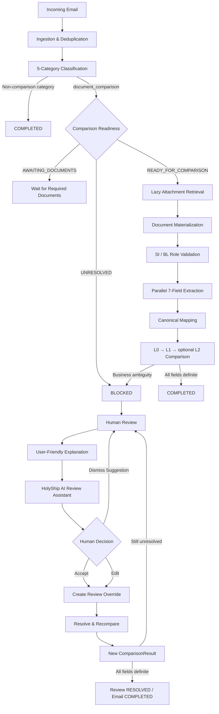
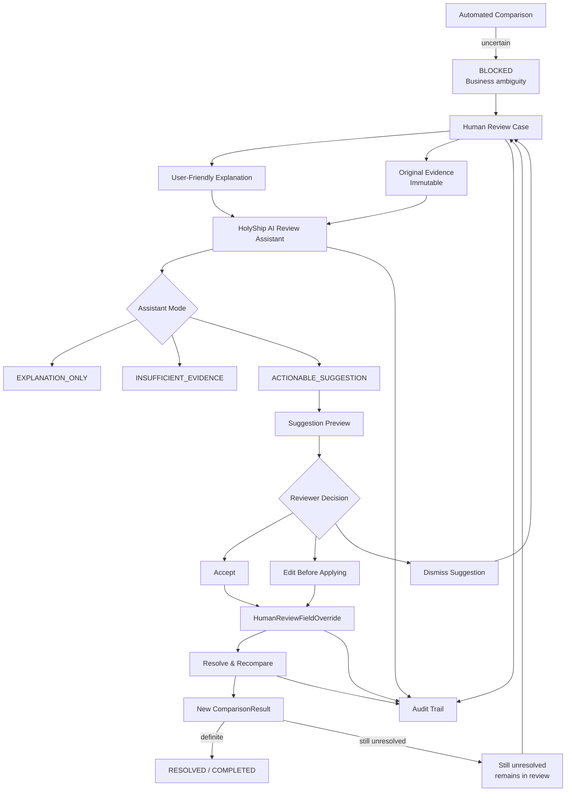
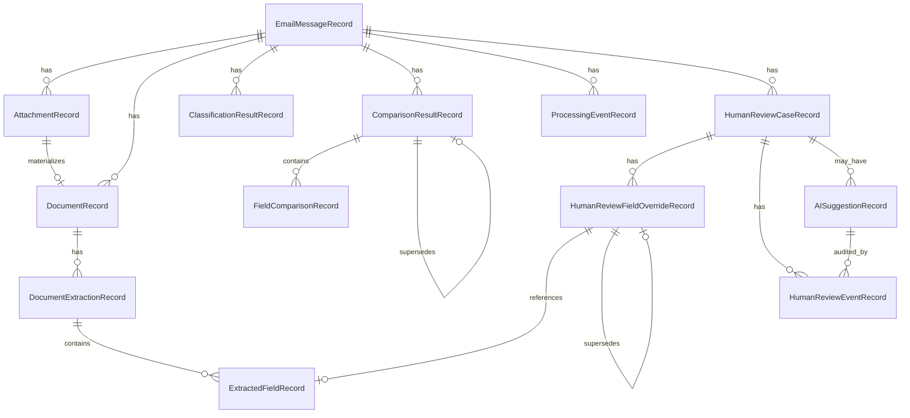

# HolyShip

**AI-assisted shipping document verification with evidence-backed Human Review and human-approved AI suggestions.**

HolyShip processes shipping-related emails end to end: it classifies incoming messages, determines whether SI–BL verification is required, retrieves and reads shipping documents, extracts seven canonical shipment fields, compares them through deterministic normalization layers, and surfaces uncertain cases for Human Review.

When a case needs human judgment, HolyShip preserves the original evidence, explains the issue in user-friendly language, and allows a reviewer to correct specific values without overwriting the automated result. The **HolyShip AI Review Assistant** can explain a case and propose grounded corrections, but every actionable suggestion requires an explicit human decision before it is applied.

> **Product principle:** Automate what can be verified confidently. Surface uncertainty clearly. Let AI explain and suggest. Let humans decide. Preserve the evidence and audit everything.

---

## Table of Contents

1. [Project Description](#1-project-description)
2. [Problem Statement](#2-problem-statement)
3. [Solution Overview](#3-solution-overview)
4. [End-to-End System Flow](#4-end-to-end-system-flow)
5. [System Architecture](#5-system-architecture)
6. [Human-in-the-Loop Architecture](#6-human-in-the-loop-architecture)
7. [HolyShip AI Review Assistant](#7-holyship-ai-review-assistant)
8. [Core Features](#8-core-features)
9. [User-Friendly Problem Mapping](#9-user-friendly-problem-mapping)
10. [Seven Comparison Fields](#10-seven-comparison-fields)
11. [Processing States](#11-processing-states)
12. [Human Review](#12-human-review)
13. [Human Review Analytics](#13-human-review-analytics)
14. [Web Dashboard](#14-web-dashboard)
15. [Outlook Add-in](#15-outlook-add-in)
16. [Data Truth and Reconciliation](#16-data-truth-and-reconciliation)
17. [Implementation Details](#17-implementation-details)
18. [Data Model](#18-data-model)
19. [Technical Stack](#19-technical-stack)
20. [API Overview](#20-api-overview)
21. [Project Structure](#21-project-structure)
22. [Getting Started](#22-getting-started)
23. [Environment Configuration](#23-environment-configuration)
24. [Testing and Quality](#24-testing-and-quality)
25. [Evaluation Approach](#25-evaluation-approach)
26. [Key Engineering Decisions](#26-key-engineering-decisions)
27. [Challenges Faced](#27-challenges-faced)
28. [Security and Data Integrity](#28-security-and-data-integrity)
29. [Current Limitations](#29-current-limitations)
30. [Impact](#30-impact)
31. [Future Roadmap](#31-future-roadmap)
32. [Demo Walkthrough](#32-demo-walkthrough)
33. [Contributors](#33-contributors)

---

# 1. Project Description

HolyShip is a shipping document verification platform that automates the workflow from an incoming email to a verified SI–BL comparison result.

The system:

- ingests shipping-related emails;
- classifies them into five operational categories;
- checks whether document comparison can proceed;
- lazily retrieves attachments only when needed;
- identifies Shipping Instruction and draft Bill of Lading documents;
- extracts seven canonical fields;
- compares SI and BL using layered deterministic normalization;
- records MATCH, MISMATCH, or UNRESOLVED per field;
- routes uncertain business cases to Human Review;
- explains technical issues in user-friendly language;
- supports reviewer corrections through immutable overrides;
- provides an AI Review Assistant that explains and suggests, but never applies changes automatically;
- exposes the workflow through a full Web Dashboard and a compact Outlook Add-in.

HolyShip is designed around **conservative automation**: when evidence is strong, the system completes the case automatically; when evidence is insufficient, it explicitly surfaces uncertainty rather than inventing a confident result.

---

# 2. Problem Statement

Shipping operations teams receive mixed inbox traffic that may include:

- SI–BL document-comparison requests;
- new Shipping Instruction requests;
- invoice queries;
- general operational messages;
- irrelevant or spam messages.

For document-comparison work, staff often need to manually open an SI and a draft BL, locate matching fields, normalize formatting differences, identify real discrepancies, and decide whether a mismatch is operationally significant.

This becomes difficult because real documents may contain:

- different labels for the same field;
- bilingual labels;
- table-based layouts;
- scanned pages;
- OCR noise;
- missing attachments;
- wrong document types;
- ambiguous filenames;
- harmless formatting differences;
- values that look similar but are not safely equivalent.

A reliable system must avoid two major failure modes:

1. **False mismatches** — formatting differences are treated as real discrepancies.
2. **False matches** — aggressive normalization hides genuine differences.

HolyShip solves this by combining deterministic comparison, explicit uncertainty, evidence-backed Human Review, and human-approved AI assistance.

---

# 3. Solution Overview

HolyShip separates automation, human judgment, and AI assistance into clear responsibilities.

```text
Automation
    ↓
Classify → Retrieve → Extract → Compare
    ↓
Confident?
  /       \
YES        NO
↓          ↓
Complete   Human Review
               ↓
        Explain the issue
               ↓
       AI may suggest safely
               ↓
        Human decides
               ↓
      Override + Recompare
               ↓
        Auditable outcome
```

The platform has three user-facing layers:

### Web Dashboard
The full operational workspace for:

- monitoring pipeline activity;
- browsing processed emails;
- viewing extracted SI/BL values;
- inspecting comparison evidence;
- managing Human Review;
- reviewing analytics;
- interacting with the AI Review Assistant.

### Outlook Add-in
A compact current-email companion for:

- seeing HolyShip status directly inside Outlook;
- viewing concise comparison and review information;
- reading user-friendly explanations;
- asking a concise AI question;
- opening the full Dashboard review or AI workflow.

### HolyShip AI Review Assistant
A context-aware assistant that can:

- explain why a case is blocked;
- summarize current evidence;
- identify affected fields;
- explain mismatches or unresolved values;
- produce structured suggestions when evidence is strong enough.

It cannot directly mutate verified data. A reviewer must explicitly Accept, Edit, or Dismiss every actionable suggestion.

---

# 4. End-to-End System Flow



---

# 5. System Architecture

```mermaid
flowchart LR

subgraph INPUT["1 · Email & Integration"]
    STATIC["Static Bundle"]
    HTTP["Organizer HTTP Source"]
    INCOMING["Incoming API"]
    GRAPH["Microsoft Graph Adapter"]
end

subgraph INGEST["2 · Ingestion & Workflow"]
    SOURCE["EmailSource Abstraction"]
    SYNC["SyncService"]
    DEDUP["Idempotency + Content Hash"]
    FSM["Processing State Machine"]
end

subgraph INTENT["3 · Intent Intelligence"]
    S1["Stage 1 Classifier"]
    S2["Stage 2 Ambiguity Resolver"]
    CATS["5 Final Categories"]
    READY["Comparison Readiness"]
end

subgraph DOCS["4 · Document Intelligence"]
    LAZY["Lazy Attachment Retrieval"]
    ROUTER["Document Router"]
    READERS["TXT · PDF · DOCX · XLSX · OCR"]
    ROLE["SI / Draft-BL Role Validation"]
    EXTRACT["One-Pass 7-Field Extraction"]
    MAP["Canonical Field Mapping"]
end

subgraph VERIFY["5 · Verification Engine"]
    L0["L0 Safe Normalization"]
    L1["L1 Field-Specific Rules"]
    L2["L2 Optional Semantic Resolver"]
    COMP["MATCH · MISMATCH · UNRESOLVED"]
end

subgraph REVIEW["6 · Human Review & AI Assistance"]
    CASE["HumanReviewCase"]
    EXPLAIN["User-Friendly Problem Mapping"]
    AI["HolyShip AI Review Assistant"]
    SUGGEST["Structured Suggestion"]
    HUMAN["Human Accept / Edit / Dismiss"]
    OVERRIDE["HumanReviewFieldOverride"]
    RECOMPARE["Resolve & Recompare"]
    AUDIT["Immutable Review / AI Events"]
end

subgraph DATA["7 · Platform & Data"]
    PG[("PostgreSQL 16")]
    ORM["SQLAlchemy 2"]
    MIGRATE["Alembic"]
    CACHE["Extraction Cache"]
    API["FastAPI"]
end

subgraph UX["8 · User Experience"]
    DASH["Web Dashboard\nFull Workspace"]
    ADDIN["Outlook Add-in\nCompact Companion"]
end

INPUT --> SOURCE --> SYNC --> DEDUP --> FSM
FSM --> S1 --> S2 --> CATS --> READY
READY --> LAZY --> ROUTER --> READERS --> ROLE --> EXTRACT --> MAP
MAP --> L0 --> L1 --> L2 --> COMP

COMP -->|"definite"| PG
COMP -->|"uncertain"| CASE
CASE --> EXPLAIN --> AI --> SUGGEST --> HUMAN --> OVERRIDE --> RECOMPARE --> COMP

CASE --> AUDIT
AI --> AUDIT
OVERRIDE --> AUDIT

FSM --> ORM --> PG
EXTRACT --> CACHE --> PG
MIGRATE --> PG

PG --> API
API --> DASH
API --> ADDIN
```



## Architecture Layers

### 1 · Email & Integration
Email providers are normalized behind a common source boundary. Static dataset ingestion, organizer HTTP input, incoming API input, and a Microsoft Graph adapter all map into the same canonical email model.

### 2 · Ingestion & Workflow
`SyncService` orchestrates processing. Duplicate messages are prevented through provider identity and content hashing. Processing transitions are persisted so every case can be traced through the workflow.

### 3 · Intent Intelligence
A two-stage classifier maps each message into exactly one of five categories. Document-comparison requests then receive a comparison-readiness decision.

### 4 · Document Intelligence
Attachments are fetched only when needed. The document router handles different formats, preserves structured content when possible, validates document role from content, and extracts the seven canonical fields.

### 5 · Verification Engine
Comparison is layered. L0 handles universal formatting normalization. L1 applies field-specific deterministic rules. L2 is optional and conservative. Each field ends as MATCH, MISMATCH, or UNRESOLVED.

### 6 · Human Review & AI Assistance
Business ambiguity is routed to Human Review. Reviewers see evidence, user-friendly explanations, and optional AI assistance. Corrections are additive overrides, and recomparison creates a new comparison version.

### 7 · Platform & Data
PostgreSQL is the source of truth. SQLAlchemy models the data layer, Alembic manages schema evolution, FastAPI exposes product APIs, and extraction caching avoids repeated work.

### 8 · User Experience
The Dashboard is the full operational workspace. The Outlook Add-in is intentionally compact and context-specific.

---

# 6. Human-in-the-Loop Architecture



## Human control is mandatory

HolyShip never treats AI output as authoritative source data.

The allowed path is:

```text
AI Suggestion
→ Human Preview
→ Accept / Edit / Dismiss
→ Human Review Override
→ Resolve & Recompare
```

The forbidden path is:

```text
AI Suggestion
→ UPDATE original extraction
```

Original extraction and historical comparison rows remain unchanged.

---

# 7. HolyShip AI Review Assistant

The **HolyShip AI Review Assistant** is designed specifically for uncertain review cases. It is not a general-purpose chatbot.

## What users can ask

Examples include:

- Why is this case blocked?
- Why does this need Human Review?
- Which fields should I check first?
- Where did this value come from?
- Why are these ports different?
- What does Unresolved mean?
- Which document is the SI?
- Summarize this case.
- Explain the gross-weight issue.
- Can you suggest the correct BL gross weight?

## Assistant response modes

### `EXPLANATION_ONLY`
Used when the assistant can explain the issue but should not propose a correction.

### `ACTIONABLE_SUGGESTION`
Used only when evidence is strong enough to support a structured field correction.

### `INSUFFICIENT_EVIDENCE`
Used when the assistant cannot safely recommend an action.

## Structured suggestion example

```json
{
  "message": "The BL gross weight likely contains an OCR character error.",
  "mode": "ACTIONABLE_SUGGESTION",
  "suggestion": {
    "action": "FIELD_OVERRIDE",
    "document_side": "BL",
    "field": "gross_weight_kg",
    "current_value": "22,O00 KG",
    "suggested_value": "22000",
    "confidence": 0.94,
    "reason": "Possible O/0 OCR confusion",
    "evidence_refs": [
      "bl-page-1-gross-weight"
    ]
  }
}
```

## Allowed actionable fields

AI suggestions are restricted to the seven canonical comparison fields:

- `shipper`
- `consignee`
- `notify_party`
- `port_of_loading`
- `port_of_discharge`
- `container_count`
- `gross_weight_kg`

## Accept / Edit / Dismiss

### Accept
The suggested value is saved as a Human Review override and comparison is re-run.

### Edit Before Applying
The reviewer can modify the AI proposal before applying it. Both the AI-proposed value and the reviewer-applied value remain auditable.

### Dismiss Suggestion
Only the AI suggestion is dismissed. The Human Review case remains unchanged.

## Safety rules

The assistant should not offer an actionable correction when:

- a required document is missing;
- evidence is unavailable;
- the wrong document type is attached;
- the relevant field is unsupported;
- entity ambiguity is too high;
- evidence conflicts without a safe conclusion.

In these cases the system returns either `EXPLANATION_ONLY` or `INSUFFICIENT_EVIDENCE`.

---

# 8. Core Features

## Intelligent Email Classification

HolyShip classifies each email into exactly one of five categories:

- `document_comparison`
- `new_si_request`
- `invoice_query`
- `general_message`
- `spam`

The classifier uses a two-stage approach so obvious cases can be resolved quickly while ambiguous cases receive additional analysis.

## Comparison Readiness

Document-comparison emails are assigned one of:

- `READY_FOR_COMPARISON`
- `AWAITING_DOCUMENTS`
- `UNRESOLVED`

`AWAITING_DOCUMENTS` is a valid operational waiting state, not a Human Review case.

## Lazy Attachment Retrieval

Attachment bytes are retrieved only after the message is confirmed ready for comparison.

## Multi-format Document Processing

HolyShip supports document materialization for:

- plain text;
- PDF;
- DOCX;
- XLSX;
- scanned/image-based documents through OCR.

## Content-based SI / BL Role Validation

Document role is determined from content rather than filename alone.

The system can identify:

- SI;
- draft BL;
- wrong document type;
- inconclusive role.

## Seven-field Extraction

HolyShip performs a single structured extraction pass and preserves:

- raw label;
- raw value;
- canonical value;
- confidence;
- source location;
- mapping provenance.

## Layered Comparison

### L0 — universal safe normalization
Examples:

- whitespace collapse;
- Unicode normalization;
- case normalization.

### L1 — field-specific deterministic normalization
Examples:

- gross weight parsing;
- container count parsing;
- port aliases;
- conservative entity normalization.

### L2 — optional semantic resolution
Used only when explicitly enabled and when deterministic layers cannot decide safely.

## Conservative Uncertainty

HolyShip never forces an uncertain field into MATCH or MISMATCH.

`UNRESOLVED` is a valid result.

## Human Review

Reviewers can:

- claim a case;
- inspect evidence;
- review Original / Reviewed / Effective values;
- apply field overrides;
- resolve and recompare;
- dismiss a case;
- inspect audit history.

## Human Review Intelligence

The review workspace includes:

- deterministic priority;
- human-readable reason;
- affected fields or affected area;
- case age;
- queue sorting;
- reviewer state;
- review history.

## Human Review Analytics

Real persisted review data supports operational analytics such as:

- Open;
- In Review;
- Resolved;
- Dismissed;
- Resolved Today;
- Average Open Age;
- Priority Distribution;
- Review Reason Distribution;
- Most Reviewed Fields;
- Most Corrected Fields.

## User-Friendly Problem Mapping

Technical backend codes are mapped into operational language that users can understand immediately.

## Outlook Integration

The Outlook Add-in shows the HolyShip state of the currently open email and provides deep links into the full review workspace.

## Auditability

Every important decision can be traced back to:

- source email;
- document;
- extraction;
- comparison;
- reviewer action;
- AI suggestion;
- recomparison result.

---

# 9. User-Friendly Problem Mapping

HolyShip separates internal diagnostic truth from user-facing presentation.

```text
Internal reason code
→ Shared presentation mapping
→ User-facing title
→ Explanation
→ Affected area
→ Suggested next action
```

Examples:

| Internal Value | User-Facing Meaning |
|---|---|
| `CLASSIFICATION_UNRESOLVED` | **Email type unclear** |
| `COMPARISON_UNRESOLVED` | **One or more document fields could not be verified** |
| `COMPARISON_MISMATCH` | **The SI and BL contain different values** |
| `DOCUMENT_ROLE_UNRESOLVED` | **HolyShip could not confidently identify which document is the SI or BL** |
| `WRONG_DOCUMENT_TYPE` | **The attached file does not appear to be the required document** |
| `MISSING_REQUIRED_ATTACHMENT` | **A required shipping document is missing** |
| `UNREADABLE_ATTACHMENT` | **The attached document could not be read reliably** |
| `MULTIPLE_CANDIDATES` | **More than one document may match the required role** |
| `READINESS_UNRESOLVED` | **HolyShip is unsure whether the documents are ready for comparison** |
| `AWAITING_DOCUMENTS` | **Waiting for required documents** |
| `FAILED` | **Processing failed — retry required** |
| `BLOCKED` | **Needs attention before processing can continue** |
| `OPEN` | **Needs review** |
| `IN_REVIEW` | **Being reviewed** |
| `RESOLVED` | **Review completed** |
| `DISMISSED` | **Review dismissed** |
| Legacy review case | **Historical review record** |

Raw diagnostic data such as candidate scores or pipeline-stage codes can still be inspected under technical details, but they are not the primary text shown to users.

## Four-layer issue presentation

Each actionable issue should answer:

1. What is wrong?
2. Why does HolyShip think this?
3. What is affected?
4. What should the user do next?

Example:

```text
Email type unclear

Why
The email contains both document-comparison language and invoice-related language.

Affected area
Email intent

Suggested action
Confirm whether this email is asking for document verification.

Technical details
[Expand]
```

This mapping is shared across both the Web Dashboard and the Outlook Add-in.

---

# 10. Seven Comparison Fields

The Shipping Instruction is the reference document. The draft BL is checked against it.

| Canonical Field | Examples of Source Labels |
|---|---|
| `shipper` | Shipper, Shipper Name, 发货人 |
| `consignee` | Consignee, Consignee Name, 收货人 |
| `notify_party` | Notify Party, Notify, 通知方 |
| `port_of_loading` | Port of Loading, POL, Load Port, 装货港 |
| `port_of_discharge` | Port of Discharge, POD, Discharge Port, 卸货港 |
| `container_count` | Number of Containers, Containers, Container Count, 箱数 |
| `gross_weight_kg` | Gross Weight, Gross Wt, Gross Weight (KG), 毛重 |

Values such as net weight or tare weight are not mapped into `gross_weight_kg`.

---

# 11. Processing States

HolyShip uses the following internal processing states:

| State | Meaning |
|---|---|
| `NEW` | Email created, not yet queued |
| `QUEUED` | Waiting for processing |
| `CLASSIFYING` | Classification running |
| `CLASSIFIED` | Classification finished |
| `AWAITING_DOCUMENTS` | Waiting for required shipping documents |
| `RETRIEVING_ATTACHMENTS` | Fetching attachment bytes |
| `EXTRACTING` | Extracting document fields |
| `COMPARING` | Comparing SI and BL |
| `COMPLETED` | Processing finished successfully |
| `BLOCKED` | Business ambiguity prevents automatic completion |
| `FAILED` | Technical processing failure |

User-facing UI uses friendly wording rather than exposing these raw values where possible.

---

# 12. Human Review

Human Review is reserved for business ambiguity that a reviewer can meaningfully resolve.

## Eligible examples

- unresolved comparison;
- unresolved document role;
- wrong document type;
- unreadable document where human inspection can help;
- multiple document candidates;
- readiness ambiguity.

## Not Human Review

### Awaiting Documents
The message is waiting for required documents. No review case is created.

### Technical Failed
The system experienced a technical processing failure. The correct path is Retry / Reprocess.

## Review lifecycle

```text
OPEN
→ IN_REVIEW
→ RESOLVED

or

OPEN / IN_REVIEW
→ DISMISSED
```

## Immutable correction model

```text
Original Extraction
        +
Active Review Override
        =
Effective Review Value
```

Reviewers never edit the original extraction row.

## Resolve & Recompare

When the reviewer applies corrections:

1. HolyShip builds effective SI and BL values.
2. The comparison engine runs again.
3. A new comparison result is persisted.
4. The new result links back to the previous comparison.
5. The review becomes RESOLVED only when the case is actually resolved.

---

# 13. Human Review Analytics

HolyShip supports review analytics from real persisted data.

Examples include:

- active Open cases;
- In Review cases;
- Resolved cases;
- Dismissed cases;
- Resolved Today;
- Average Open Age;
- Priority Distribution;
- Review Reason Distribution;
- Most Reviewed Fields;
- Most Corrected Fields.

Correction insight categories may include:

- OCR ambiguity;
- missing extraction;
- value normalization;
- entity ambiguity;
- manual source confirmation.

These insights are analytical only. They do not automatically change production extraction or comparison logic.

---

# 14. Web Dashboard

The Web Dashboard is the full operational workspace.

## Overview

Provides real persisted summary metrics such as:

- Total Emails;
- Completed;
- Needs Review;
- Waiting for Documents;
- Processing Failed;
- Currently Processing;
- mismatch metrics defined at a documented unit.

## Email Queue

Supports operational browsing and filtering by:

- processing status;
- classification category;
- comparison readiness;
- search text;
- review state;
- mismatch state;
- date range where supported.

## Email Detail

Shows:

- sender and subject;
- classification;
- attachments;
- document roles;
- SI/BL values;
- comparison result;
- evidence;
- processing timeline;
- Human Review state.

## Human Review Workspace

Shows:

- priority;
- user-friendly issue title;
- why the case needs review;
- affected fields or affected area;
- review age;
- reviewer state;
- Original / Reviewed / Effective values;
- evidence;
- audit timeline;
- Resolve & Recompare;
- Dismiss.

## AI Review Assistant

The Human Review detail includes the full AI workspace:

- suggested questions;
- case-aware chat;
- evidence-grounded explanations;
- structured suggestion cards;
- Accept;
- Edit Before Applying;
- Dismiss Suggestion.

---

# 15. Outlook Add-in

The Outlook Add-in is a **compact current-email companion**, not a second Dashboard.

It uses the same backend and the same semantic mapping as the Dashboard.

## Supported states

The task pane provides clear user-facing states for:

- Not in HolyShip;
- Processing;
- Completed;
- Waiting for Documents;
- Needs Review;
- Processing Failed;
- Historical Review Record.

## Current email summary

The Add-in can display:

- sender;
- subject;
- HolyShip classification;
- processing state;
- comparison readiness;
- compact seven-field comparison;
- active review state;
- user-friendly reason;
- affected field or area.

## User-friendly wording

The Outlook Add-in does not lead with internal strings such as:

```text
Classification unresolved after Stage 2
COMPARISON_UNRESOLVED
HISTORICAL LEGACY CASE
0 affected field(s)
```

Instead it uses the same shared mapping as the Dashboard.

Examples:

```text
Email type unclear
```

```text
One or more document fields could not be verified
```

```text
Historical review record
No action required
```

## AI Companion

Outlook provides a lightweight AI experience:

- ask a concise question about the current email;
- view an evidence-grounded explanation;
- see whether an AI suggestion is available;
- open the full AI Review workflow in Dashboard.

Complex editing and evidence inspection remain in the Dashboard.

## Deep Links

The Add-in can open:

```text
?email=<id>
```

and:

```text
?review=<id>
```

directly in the Dashboard.

---

# 16. Data Truth and Reconciliation

HolyShip treats dashboard metrics as product data, not decoration.

Every visible count should be explainable from persisted state.

## Processing-state reconciliation

Where summary cards represent a mutually exclusive state breakdown:

```text
Total Emails
=
Completed
+ Waiting for Documents
+ Needs Review / Blocked
+ Processing Failed
+ Currently Processing
+ any explicitly defined remaining bucket
```

If a metric overlaps with another metric, the UI should make that clear.

## Active vs Historical Review

Active Human Review and historical legacy review records are separated.

A historical row with an old persisted `OPEN` state must not be shown as current actionable work.

User-facing presentation should prefer:

```text
Historical review record
No action required
```

## Metric units

HolyShip does not silently mix:

- number of emails;
- number of review cases;
- number of fields;
- number of historical records.

Metrics are labeled according to their actual unit.

## Mismatch metric

Mismatch metrics are explicitly defined, for example:

- emails with at least one mismatched field; or
- total mismatched fields.

The Dashboard does not present an unexplained `Mismatch = 0` from an incompatible query definition.

---

# 17. Implementation Details

## A. Email Ingestion

Incoming messages are normalized into a provider-neutral email model. Idempotency guards prevent duplicate ingestion across repeated polling or sync operations.

## B. Classification

Stage 1 handles high-confidence cases using deterministic signals. Stage 2 handles ambiguity and mixed intent.

The final category is always one of the five supported categories.

## C. Comparison Readiness

Only `document_comparison` emails are evaluated for comparison readiness.

`AWAITING_DOCUMENTS` remains a first-class operational wait state.

## D. Document Processing

Attachments are lazily retrieved and materialized through the appropriate document reader. File content, not filename alone, is used to validate whether a document is the SI or draft BL.

## E. Extraction

A single extraction pass populates all seven canonical fields and preserves mapping provenance and evidence location.

## F. Comparison

The comparison engine processes each field through:

```text
L0
→ L1
→ optional L2
```

and returns:

```text
MATCH
MISMATCH
UNRESOLVED
```

## G. Human Review

Human Review uses additive overrides and immutable audit events. Resolving a case never overwrites the original automated extraction.

## H. AI Review

AI responses are validated structured outputs. Actionable suggestions are restricted to the seven canonical fields and require explicit human approval.

## I. Persistence

PostgreSQL stores operational state, document state, extraction results, comparison results, Human Review state, analytics inputs, and audit events.

## J. Frontends

Dashboard and Outlook use the same backend and shared semantic contract, but are intentionally different in density and interaction depth.

---

# 18. Data Model



The exact internal table names may differ by migration version, but the data model preserves the same core relationships: email → documents → extractions → comparisons → Human Review → overrides / AI-assisted events.

---

# 19. Technical Stack

| Layer | Technology |
|---|---|
| Backend | Python 3.11+ |
| API | FastAPI + Uvicorn |
| ORM | SQLAlchemy 2 |
| Database | PostgreSQL 16 |
| Migrations | Alembic |
| PDF | pypdf |
| DOCX | python-docx |
| XLSX | openpyxl |
| OCR | Tesseract |
| HTTP | httpx |
| Dashboard | React 19 + TypeScript |
| Build | Vite |
| Icons | lucide-react |
| Frontend Tests | Vitest + Testing Library |
| Outlook | Office.js |
| Add-in Dev TLS | Vite basic SSL |
| Backend Tests | pytest |
| Configuration | pydantic-settings |
| Container Support | Docker Compose |

---

# 20. API Overview

Representative product endpoints include:

| Method | Endpoint | Purpose |
|---|---|---|
| `GET` | `/api/health` | Backend health |
| `POST` | `/api/sync` | Trigger sync |
| `POST` | `/api/email/incoming` | Ingest incoming email |
| `GET` | `/api/v1/summary` | Dashboard summary |
| `GET` | `/api/v1/emails` | Filtered email queue |
| `GET` | `/api/v1/emails/{id}` | Full email detail |
| `POST` | `/api/v1/emails/{id}/reprocess` | Retry failed processing |
| `GET` | `/api/v1/human-review` | Human Review queue |
| `GET` | `/api/v1/human-review/{id}` | Human Review detail |
| `POST` | `/api/v1/human-review/{id}/claim` | Claim case |
| `POST` | `/api/v1/human-review/{id}/overrides` | Save reviewer correction |
| `POST` | `/api/v1/human-review/{id}/resolve` | Resolve & Recompare |
| `POST` | `/api/v1/human-review/{id}/dismiss` | Dismiss review case |
| `GET` | `/api/v1/human-review-analytics` | Review analytics |
| `POST` | `/api/v1/human-review/{id}/ai/ask` | Ask AI about current review |
| `POST` | `/api/v1/human-review/{id}/ai/suggestions/{suggestion_id}/accept` | Accept AI suggestion |
| `POST` | `/api/v1/human-review/{id}/ai/suggestions/{suggestion_id}/apply-edited` | Apply edited suggestion |
| `POST` | `/api/v1/human-review/{id}/ai/suggestions/{suggestion_id}/dismiss` | Dismiss AI suggestion |
| `GET` | `/api/v1/events` | Poll product updates |

> Endpoint names for AI operations may vary slightly with the final implementation, but the contract follows the same human-approval model.

---

# 21. Project Structure

```text
HolyShip/
├── backend/
│   ├── app/
│   │   ├── api/                  # FastAPI routes, schemas, product queries
│   │   ├── classification/       # Stage 1 / Stage 2 classification
│   │   ├── comparison/           # L0 / L1 / L2 comparison
│   │   ├── core/                 # Configuration and reliability utilities
│   │   ├── documents/            # Materialization, routing, readers, role validation
│   │   ├── extraction/           # Seven-field extraction and mapping
│   │   ├── ingestion/            # Email source adapters and runtime
│   │   ├── resolution/           # Optional semantic resolution
│   │   ├── review/               # Human Review lifecycle and recomparison
│   │   ├── ai_review/            # AI Review Assistant provider / suggestion layer
│   │   ├── storage/              # SQLAlchemy models and repositories
│   │   ├── sync/                 # Processing orchestration
│   │   ├── main.py
│   │   └── submission_adapter.py
│   ├── alembic/
│   │   └── versions/
│   ├── tests/
│   └── requirements.txt
├── frontend/
│   ├── src/
│   │   ├── api/
│   │   ├── components/
│   │   ├── lib/
│   │   └── App.tsx
│   └── package.json
├── outlook-addin/
│   ├── src/
│   │   ├── api/
│   │   ├── components/
│   │   ├── office/
│   │   └── types/
│   ├── manifest.xml
│   └── package.json
├── docs/
│   ├── human_review.md
│   ├── ui_design_system.md
│   ├── requirements_matrix.md
│   └── scope_decisions/
├── reports/
├── scripts/
├── data/
├── docker-compose.yml
├── alembic.ini
├── Makefile
└── README.md
```

---

# 22. Getting Started

## Prerequisites

- Python 3.11+
- PostgreSQL 16
- Node.js 20+
- npm
- Tesseract OCR if scanned-document support is required

## 1. Clone

```bash
git clone <repository-url>
cd HolyShip
```

## 2. Configure environment

Create `.env` from `.env.example` and configure your local database and bundle paths.

Never commit `.env`.

## 3. Create Python environment

### Windows

```bat
python -m venv .venv
.venv\Scripts\activate
```

If `python` is not registered globally but the project environment already exists:

```bat
.venv\Scripts\python.exe --version
```

## 4. Install backend dependencies

```bash
pip install -r backend/requirements.txt
```

## 5. Run migrations

```bash
python -m alembic upgrade head
```

or on Windows using the project environment directly:

```bat
.venv\Scripts\python.exe -m alembic upgrade head
```

## 6. Start backend

```bash
python -m uvicorn backend.app.main:app --reload --port 8000
```

or:

```bat
.venv\Scripts\python.exe -m uvicorn backend.app.main:app --reload --port 8000
```

API documentation is available at:

```text
http://localhost:8000/docs
```

## 7. Start Dashboard

```bash
cd frontend
npm install
npm run dev
```

Typical development URL:

```text
http://localhost:5173
```

## 8. Start Outlook Add-in

```bash
cd outlook-addin
npm install
npm run dev
```

The task pane is served over local HTTPS, typically at:

```text
https://localhost:3200/taskpane.html
```

The page can be previewed in a browser, but full Office context is only available when the Add-in is sideloaded and opened inside Outlook.

---

# 23. Environment Configuration

Common configuration includes:

| Variable | Purpose |
|---|---|
| `DATABASE_URL` | Development PostgreSQL connection |
| `HOLYSHIP_TEST_DATABASE_URL` | Isolated test database |
| `HOLYSHIP_EVAL_DATABASE_URL` | Isolated evaluation database |
| `ORGANIZER_BUNDLE_PATH` | Dataset location |
| `CLASSIFICATION_THRESHOLD` | Stage 1 confidence threshold |
| `CLASSIFICATION_MARGIN_THRESHOLD` | Stage 1 margin requirement |
| `SYNC_MAX_WORKERS` | Email-processing concurrency |
| `EXTRACTION_MAX_WORKERS` | Extraction concurrency |
| `MAX_ATTACHMENT_BYTES` | Incoming attachment size limit |
| `OCR_TIMEOUT_SECONDS` | OCR timeout |
| `OCR_MAX_CALLS` | OCR budget |
| `CORS_ALLOWED_ORIGINS` | Allowed frontend origins |
| `AI_REVIEW_ENABLED` | Enable AI Review Assistant |
| `AI_REVIEW_PROVIDER` | Configured provider |
| `AI_REVIEW_API_KEY` | Provider secret |
| `AI_REVIEW_TIMEOUT_SECONDS` | AI request timeout |
| `AI_ESCALATION_ENABLED` | Optional L2 comparison semantic resolver |
| `AI_PROVIDER` | Optional L2 provider |

AI provider secrets belong in environment configuration only.

---

# 24. Testing and Quality

HolyShip uses backend, reliability, Dashboard, Outlook, and repository-level validation.

## Backend

```bash
python -m pytest
```

Known stabilized baseline before later feature additions:

```text
299 passed
0 failed
```

## Reliability

```bash
make reliability
```

Known stabilized baseline:

```text
14 passed
```

## Dashboard

```bash
cd frontend
npm run typecheck
npm run test
npm run build
```

Known stabilized baseline before later feature additions:

```text
12 tests passed
```

## Outlook Add-in

```bash
cd outlook-addin
npm run typecheck
npm run test
npm run build
```

Known stabilized baseline before later feature additions:

```text
57 tests passed
```

## Repository gates

```bash
make check-fast
make check PHASE=F
git diff --check
```

Known stabilized Phase F trace:

```text
114 PASS
0 TODO
0 FAIL
2 WAIVED
```

Later Human Review, AI Review Assistant, data-reconciliation, and Outlook-mapping tests are expected to increase these counts.

---

# 25. Evaluation Approach

HolyShip maintains separate databases for:

- development;
- testing;
- evaluation.

The evaluation pipeline is isolated from manual review state.

The automated baseline follows:

```text
Input Dataset
→ Automatic HolyShip Pipeline
→ Submission Adapter
→ Evaluation Output
```

It does **not** use:

- manually accepted Human Review overrides;
- AI suggestion acceptance;
- organizer private answer data;
- ground-truth-specific rules.

This keeps the automated benchmark representative of the actual automatic pipeline.

---

# 26. Key Engineering Decisions

## Deterministic first

Classification, extraction, and comparison aim to resolve as much as possible through deterministic logic before escalating to more expensive or less predictable semantic reasoning.

## Uncertainty is explicit

`UNRESOLVED` is better than a fabricated answer.

## Lazy attachment retrieval

Attachments are fetched only when comparison actually requires them.

## SI is the reference

The Shipping Instruction represents intended shipment details. The draft BL is checked against it.

## Original evidence is immutable

Automated extraction is never overwritten by Human Review or AI.

## Human Review uses overlays

Reviewer corrections are additive overrides.

## AI never auto-applies

AI can explain and suggest. Humans decide.

## Dashboard and Outlook share semantics

They use the same status meanings, user-facing problem mapping, and design language while keeping different interaction density.

## Data metrics must reconcile

Summary counts must be traceable to persisted data and clearly identify their unit.

---

# 27. Challenges Faced

## Ambiguous email intent

Shipping emails often mix operational language, document references, and billing terms.

**Solution:** two-stage classification plus user-friendly Human Review escalation when intent remains unclear.

## Formatting differences vs real discrepancies

Values such as:

```text
22,000 KG
```

and:

```text
22000 kg
```

should not be treated as different.

**Solution:** layered normalization.

## Content vs filename

A filename cannot reliably identify whether a file is really an SI or draft BL.

**Solution:** validate document role from content.

## Structured XLSX / table documents

Flattening tables into plain text can destroy field relationships.

**Solution:** preserve structure and mapping provenance.

## OCR ambiguity

Characters such as:

```text
22,O00
```

may contain an `O` instead of a zero.

**Solution:** preserve raw evidence, surface uncertainty, and allow evidence-grounded AI assistance with human approval.

## Human correction without destroying history

Directly editing extracted rows would destroy provenance.

**Solution:** additive overrides plus comparison versioning.

## Legacy review records

Historical cases may retain an old `OPEN` status even though the email later completed.

**Solution:** separate active vs historical semantics and show historical records as non-actionable.

## Technical language overwhelming users

Raw strings such as:

```text
CLASSIFICATION_UNRESOLVED
Stage 2 unresolved
HISTORICAL LEGACY CASE
```

are accurate internally but confusing operationally.

**Solution:** shared user-friendly presentation mapping for Dashboard and Outlook.

## Summary metrics that do not reconcile

Independent KPI queries can produce totals that appear contradictory.

**Solution:** define metric units, source queries, active/historical scope, and processing-state reconciliation explicitly.

---

# 28. Security and Data Integrity

HolyShip follows several integrity principles:

- database access through SQLAlchemy;
- secrets stored in environment variables;
- no private organizer answer data in application logic;
- immutable original extraction;
- immutable historical comparison;
- additive review overrides;
- AI suggestions separated from source evidence;
- human approval before any AI-assisted correction;
- attachment size controls;
- CORS configuration;
- evaluation database isolation.

The current project does not claim production-grade identity assurance unless authentication/RBAC is configured.

---

# 29. Current Limitations

Depending on deployment environment, the following may still require production hardening:

- authentication and role-based access control;
- live Microsoft Graph OAuth/token management;
- production-grade Outlook deployment;
- stronger layout-aware OCR;
- hosted AI provider configuration;
- document-page rendering with bounding-box highlights;
- durable event streaming instead of polling;
- production observability and tracing;
- verified reviewer identity rather than free-text reviewer labels.

These limitations do not change the core Human Review and AI safety model.

---

# 30. Impact

## Operational

HolyShip reduces repetitive manual document checking by automating classification, document routing, extraction, normalization, and comparison.

## Human

Reviewers spend time only where judgment is required and receive evidence, explanation, and clear next actions rather than raw backend diagnostics.

## AI

AI is used as a decision-support layer instead of an autonomous data editor.

## Audit

The system preserves a traceable chain from:

```text
Email
→ Document
→ Extraction
→ Comparison
→ Review
→ AI Suggestion
→ Human Decision
→ Recomparison
```

## Product

Dashboard and Outlook present one consistent operational language across different work contexts.

---

# 31. Future Roadmap

With the core Human Review, AI Review Assistant, user-friendly mapping, analytics, Dashboard, and Outlook experience in place, future work focuses on productionization rather than redesigning the core workflow.

Potential future improvements include:

- authentication and RBAC;
- production Microsoft Graph ingestion;
- stronger OCR and document-layout understanding;
- document preview with evidence highlighting;
- richer operational observability;
- workload / SLA analytics;
- durable live-update transport;
- deployment automation;
- production AI-provider governance;
- offline learning from aggregate review patterns.

Any learning from review data should remain controlled and offline rather than automatically changing production rules.

---

# 32. Demo Walkthrough

A strong HolyShip demo can show the following sequence.

## Scenario A — Normal comparison

```text
Email arrives
→ classified as document comparison
→ SI + BL identified
→ seven fields extracted
→ comparison completes
→ final result displayed
```

## Scenario B — Human Review

```text
Comparison contains unresolved field
→ case becomes BLOCKED
→ Human Review opens
→ reviewer inspects evidence
→ reviewer applies correction
→ Resolve & Recompare
→ new comparison result created
→ review resolved
```

## Scenario C — AI-assisted review

```text
Reviewer opens uncertain case
→ asks HolyShip AI:
  "Why is gross weight unresolved?"
→ AI explains the source evidence
→ AI suggests:
  22,O00 KG → 22,000 KG
→ reviewer sees preview
→ reviewer Accepts or Edits
→ override saved
→ Resolve & Recompare
→ new result becomes MATCH
→ original extraction remains preserved
→ audit timeline records the full process
```

## Scenario D — Awaiting Documents

```text
Comparison request received
→ required document has not arrived yet
→ Waiting for Documents
→ no Human Review case created
```

## Scenario E — Technical failure

```text
Processing error
→ Processing Failed
→ Retry / Reprocess
```

## Scenario F — Outlook

```text
Open current email in Outlook
→ HolyShip task pane shows current state
→ user reads friendly explanation
→ user opens Review / AI Review in Dashboard
```

---

# 33. Contributors

- Wong Jia Hui
- Bong Zi Shan
- Lee Mei Shuet
- Christ Ting Shin Ling
- Gan Rui En

---

> **HolyShip — Automation where confident. Human control where uncertain.**
