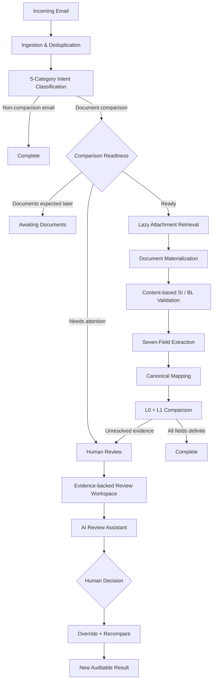

# HolyShip

### Multi-stage AI-assisted verification for shipping documents — from inbox to trusted SI–BL comparison.

HolyShip is an end-to-end shipping document verification platform built for operational teams that need to process email requests quickly **without sacrificing evidence, traceability, or human control**.

Instead of treating document verification as a single AI prediction, HolyShip uses a **multi-stage verification pipeline**: email intent classification, comparison readiness, attachment retrieval, content-based document role validation, structured extraction, deterministic normalization, seven-field comparison, Human Review, and AI-assisted exception handling.

> **HolyShip principle:** Automate what can be verified confidently. Escalate only what genuinely needs judgment. Keep every decision explainable and auditable.

---

## Live Deployment

- Dashboard: [https://holyship.onrender.com/](https://holyship.onrender.com/)
- Backend API: [https://holyship-backend.onrender.com](https://holyship-backend.onrender.com)

---

## 🚢 Why HolyShip Stands Out

### 1. Verification happens in stages — not in one black box

HolyShip does not jump straight from an email to a final answer. Every comparison passes through dedicated verification gates:

```text
Email Intent
    ↓
Comparison Readiness
    ↓
Attachment Retrieval
    ↓
Document Type & SI/BL Role Validation
    ↓
Seven-Field Extraction
    ↓
Canonical Mapping
    ↓
Deterministic Normalization
    ↓
SI ↔ BL Comparison
    ↓
Complete / Wait / Human Review
```

This makes the workflow easier to trust, explain, debug, and audit.

### 2. HolyShip distinguishes a real mismatch from uncertainty

Each canonical field receives one of three outcomes:

- `MATCH` — values are confidently equivalent;
- `MISMATCH` — values are confidently different;
- `UNRESOLVED` — evidence is not strong enough to decide safely.

A definite mismatch does **not** automatically become Human Review. If all seven fields are definite, HolyShip can complete the comparison and report the discrepancy immediately.

### 3. Human Review is evidence-backed, not a dead-end queue

When judgment is required, reviewers can see:

- the email context;
- SI and BL source values;
- raw and canonical values;
- comparison evidence;
- affected fields;
- review reason and priority;
- Original / Reviewed / Effective values;
- immutable review history.

Corrections are stored as overlays instead of overwriting the original extraction.

### 4. AI assists the reviewer — the human stays in control

The **HolyShip AI Review Assistant** can explain why a case is blocked, summarize evidence, and produce grounded field suggestions.

Every actionable suggestion still requires an explicit reviewer decision:

```text
AI explains
    ↓
AI proposes a structured suggestion
    ↓
Reviewer Accepts / Edits / Dismisses
    ↓
Override is stored separately
    ↓
Resolve & Recompare
    ↓
New auditable comparison result
```

### 5. HolyShip works where the user already works

The platform provides two connected experiences:

- **Web Dashboard** — full operational monitoring, comparison details, Human Review, analytics, and AI Review.
- **Outlook Add-in** — compact current-email verification directly inside Outlook, with deep links into the full Dashboard workflow.

---

# 1. The Problem

Shipping teams receive mixed inbox traffic every day: Shipping Instructions, draft Bills of Lading, invoice questions, document-check requests, operational messages, and spam.

For SI–BL verification, staff often need to manually:

1. identify the actual request in an email;
2. determine whether the required documents have arrived;
3. identify which attachment is the SI and which is the draft BL;
4. locate matching shipment fields across different layouts;
5. normalize harmless formatting differences;
6. identify real discrepancies;
7. decide whether uncertain values need human attention;
8. record the decision for audit purposes.

HolyShip turns that workflow into one traceable system.

---

# 2. The HolyShip Solution



---

# 3. End-to-End Workflow

## Step 1 — Email Ingestion

HolyShip ingests incoming messages through a source abstraction and persists them with idempotency protection.

## Step 2 — Five-Category Classification

Every email is classified into exactly one operational category:

- `document_comparison`
- `new_si_request`
- `invoice_query`
- `general_message`
- `spam`

The classifier uses a staged decision flow so clear cases are processed immediately while ambiguous signals receive additional resolution.

## Step 3 — Comparison Readiness

Only `document_comparison` emails continue into document verification.

Readiness is represented explicitly as:

- `READY_FOR_COMPARISON`
- `AWAITING_DOCUMENTS`
- `UNRESOLVED`

This is important because **waiting for a future document is operationally different from a failed or blocked comparison**.

## Step 4 — Lazy Attachment Retrieval

HolyShip retrieves attachment bytes only when the email is confirmed as a comparison workflow that is ready to proceed.

## Step 5 — Content-Based Document Validation

Attachments are validated from their contents rather than trusted by filename alone.

HolyShip can distinguish:

- Shipping Instruction;
- draft Bill of Lading;
- wrong document type;
- unreadable/corrupted document;
- ambiguous document role.

## Step 6 — Structured Extraction

The system extracts seven canonical fields while preserving evidence such as raw label, raw value, canonical value, confidence, and source location.

## Step 7 — Layered Comparison

HolyShip compares the SI reference against the BL using deterministic normalization layers.

```text
Raw values
   ↓
L0 Universal Normalization
   ↓
L1 Field-Specific Normalization
   ↓
MATCH / MISMATCH / UNRESOLVED
```

An optional semantic layer can be integrated for carefully controlled cases without replacing the deterministic core.

## Step 8 — Complete, Wait, or Review

The workflow finishes in the state that best reflects the evidence:

- **Completed** — all seven fields are definite;
- **Waiting for Documents** — the email explicitly indicates required documents will arrive later;
- **Needs Review** — business evidence remains unresolved;
- **Processing Failed** — technical retry/reprocessing path.

---

# 4. Seven Canonical Comparison Fields

HolyShip focuses the SI–BL verification workflow on seven shipment-critical fields:

| Field | Purpose |
|---|---|
| `shipper` | Shipping party / exporter |
| `consignee` | Receiving party |
| `notify_party` | Notify party details |
| `port_of_loading` | Origin port |
| `port_of_discharge` | Destination port |
| `container_count` | Number of containers |
| `gross_weight_kg` | Gross shipment weight in kilograms |

The **SI is treated as the reference**, and the BL is checked against it.

---

# 5. Intelligent Normalization

Real shipping documents rarely use perfectly identical formatting. HolyShip removes harmless variation while preserving meaningful differences.

## L0 — Universal normalization

Examples:

- Unicode normalization;
- case normalization;
- whitespace collapse;
- safe punctuation cleanup.

## L1 — Field-specific deterministic normalization

Examples include:

### Container count

```text
3
03
3 containers
3 x 40HC
```

can be interpreted consistently when the count is unambiguous.

### Gross weight

```text
22,000 KG
22000 kg
22 000 KGS
```

can be normalized to a comparable numeric representation.

### Ports

Port values use safe canonical formatting and configured alias handling.

### Parties

Shipper, consignee, and notify-party values use conservative entity normalization so formatting noise is removed without merging potentially different companies.

---

# 6. Human-in-the-Loop Verification

HolyShip treats Human Review as a first-class workflow rather than a fallback screen.

## Active Reviews

The Active workspace contains current actionable review cases:

```text
case_origin = ACTIVE
status = OPEN or IN_REVIEW
```

Reviewers can:

- inspect evidence;
- claim a case;
- inspect affected fields;
- compare original and effective values;
- add field-level overrides;
- Resolve & Recompare;
- inspect the audit timeline.

## History

Completed review activity is kept separately from the active work queue.

History includes:

- legacy audit records;
- resolved reviews;
- dismissed reviews.

This keeps the operational queue focused while preserving traceability.

## Immutable Corrections

HolyShip never edits the original automated extraction in place.

```text
Original Extraction
        ↓
Human Review Override
        ↓
Effective Reviewed Value
        ↓
New Comparison Version
```

That means both the machine result and the human decision remain auditable.

---

# 7. HolyShip AI Review Assistant

The AI Review Assistant is purpose-built for shipping-document review rather than general chat.

Reviewers can ask questions such as:

- Why does this case need review?
- Which field should I inspect first?
- Where did this value come from?
- Why is this port unresolved?
- Summarize this case.
- Suggest a correction for the BL gross weight.

The assistant returns one of three structured modes:

- `EXPLANATION_ONLY`
- `ACTIONABLE_SUGGESTION`
- `INSUFFICIENT_EVIDENCE`

## Grounded Suggestions

When evidence supports a correction, HolyShip can return a structured proposal:

```json
{
  "mode": "ACTIONABLE_SUGGESTION",
  "suggestion": {
    "action": "FIELD_OVERRIDE",
    "document_side": "BL",
    "field": "gross_weight_kg",
    "current_value": "22,O00 KG",
    "suggested_value": "22000",
    "confidence": 0.94,
    "reason": "Possible OCR O/0 character confusion"
  }
}
```

The reviewer remains the decision-maker through **Accept**, **Edit Before Applying**, or **Dismiss Suggestion**.

---

# 8. Web Dashboard

The Dashboard is the full HolyShip operational workspace.

## Operational Overview

At a glance, users can monitor:

- total processed emails;
- completed workflows;
- waiting-document cases;
- active Human Review cases;
- failed/retry-required processing;
- persisted review analytics.

## Email Queue

Users can browse and filter processed messages with persisted backend truth rather than fabricated frontend values.

## Email Detail

Each email can expose:

- classification;
- processing status;
- readiness;
- attachments;
- extracted fields;
- SI–BL comparison;
- mismatch / unresolved evidence;
- related review state.

## Human Review Workspace

The review interface includes:

- **Active Reviews / History** segmented views;
- search and filters;
- reviewer assignment;
- deterministic priority;
- human-readable explanations;
- evidence panels;
- Original / Reviewed / Effective values;
- audit timeline;
- AI Review Assistant.

---

# 9. Outlook Add-in

HolyShip brings the same workflow directly into Outlook.

The task pane shows the state of the currently opened email using the same terminology as the Dashboard.

Supported user-facing states include:

- Not in HolyShip
- Processing
- Completed
- Waiting for Documents
- Needs Review
- Processing Failed

For comparison emails, the Add-in provides a compact seven-field summary and can show:

- Match / Mismatch / Unresolved totals;
- review reason;
- priority;
- affected fields;
- reviewer state;
- user-friendly explanations;
- deep links to the full Dashboard review.

This creates a smooth workflow from **email → verification → review** without forcing the user to search across separate systems.

---

# 10. Human Review Analytics

HolyShip turns persisted review data into operational insight.

Analytics can include:

- Open reviews;
- In Review;
- Resolved;
- Dismissed;
- Resolved Today;
- Average Open Age;
- Priority Distribution;
- Review Reason Distribution;
- Most Reviewed Fields;
- Most Corrected Fields.

The same persisted data that powers the workflow powers the analytics, keeping operational metrics traceable.

---

# 11. User-Friendly Operational Language

HolyShip separates internal diagnostic codes from the wording shown to users.

Examples:

| Internal State | User-Facing Meaning |
|---|---|
| `CLASSIFICATION_UNRESOLVED` | Email type unclear |
| `COMPARISON_UNRESOLVED` | One or more document fields could not be verified |
| `COMPARISON_MISMATCH` | The SI and BL contain different values |
| `DOCUMENT_ROLE_UNRESOLVED` | Could not confidently identify the SI or BL |
| `WRONG_DOCUMENT_TYPE` | The attached file is not the required document |
| `MISSING_REQUIRED_ATTACHMENT` | A required shipping document is missing |
| `UNREADABLE_ATTACHMENT` | The attached document could not be read reliably |
| `AWAITING_DOCUMENTS` | Waiting for required documents |
| `BLOCKED` | Needs attention before processing can continue |
| `FAILED` | Processing failed — retry required |

This keeps technical detail available for debugging while giving operational users concise next actions.

---

# 12. Architecture

```mermaid
flowchart LR

subgraph INPUT[Email & Integration]
    STATIC[Static Bundle]
    HTTP[HTTP Source]
    INCOMING[Incoming API]
    GRAPH[Microsoft Graph Adapter]
end

subgraph WORKFLOW[Workflow Engine]
    SOURCE[EmailSource]
    SYNC[Sync Service]
    FSM[Processing State Machine]
end

subgraph INTENT[Intent Intelligence]
    S1[Stage 1 Classifier]
    S2[Stage 2 Resolver]
    READY[Comparison Readiness]
end

subgraph DOCS[Document Intelligence]
    LAZY[Lazy Retrieval]
    ROUTER[Document Router]
    READERS[TXT / PDF / DOCX / XLSX / OCR]
    ROLE[SI / BL Validation]
    EXTRACT[Seven-Field Extraction]
end

subgraph VERIFY[Verification Engine]
    MAP[Canonical Mapping]
    L0[L0 Normalization]
    L1[L1 Field Rules]
    RESULT[Match / Mismatch / Unresolved]
end

subgraph REVIEW[Human + AI Review]
    QUEUE[Active Review Queue]
    AI[AI Review Assistant]
    OVERRIDE[Immutable Override]
    RECOMPARE[Resolve & Recompare]
    HISTORY[Audit History]
end

subgraph EXPERIENCE[User Experience]
    DASH[Web Dashboard]
    OUTLOOK[Outlook Add-in]
end

INPUT --> SOURCE --> SYNC --> FSM --> S1 --> S2 --> READY
READY --> LAZY --> ROUTER --> READERS --> ROLE --> EXTRACT --> MAP --> L0 --> L1 --> RESULT
RESULT --> QUEUE --> AI --> OVERRIDE --> RECOMPARE --> RESULT
QUEUE --> HISTORY
RESULT --> DASH
QUEUE --> DASH
DASH --> OUTLOOK
```



---

# 13. Processing States

HolyShip models workflow progress explicitly:

```text
NEW
QUEUED
CLASSIFYING
CLASSIFIED
AWAITING_DOCUMENTS
RETRIEVING_ATTACHMENTS
EXTRACTING
COMPARING
COMPLETED
BLOCKED
FAILED
```

This state machine makes it clear whether an email is processing, waiting, complete, reviewable, or ready for technical retry.

---

# 14. Technical Stack

| Layer | Technology |
|---|---|
| Backend | Python 3.11, FastAPI |
| Persistence | PostgreSQL, SQLAlchemy |
| Migrations | Alembic |
| Dashboard | React, TypeScript, Vite |
| Outlook Add-in | React, TypeScript, Office.js |
| Document Readers | TXT, PDF, DOCX, XLSX |
| OCR | Tesseract-compatible OCR path |
| AI Review | Provider abstraction with structured safety validation |
| Testing | Pytest, Vitest |
| Quality Gates | Make targets, traceability checks, diff hygiene |

---

# 15. API Highlights

Key product endpoints include:

```text
GET  /api/v1/summary
GET  /api/v1/emails
GET  /api/v1/emails/{email_id}
GET  /api/v1/human-review
GET  /api/v1/human-review/{review_id}
GET  /api/v1/human-review-analytics

POST /api/v1/human-review/{review_id}/claim
POST /api/v1/human-review/{review_id}/overrides
POST /api/v1/human-review/{review_id}/resolve
POST /api/v1/human-review/{review_id}/dismiss

POST /api/v1/human-review/{review_id}/ai/ask
POST /api/v1/human-review/{review_id}/ai/suggestions/{suggestion_id}/accept
POST /api/v1/human-review/{review_id}/ai/suggestions/{suggestion_id}/apply-edited
POST /api/v1/human-review/{review_id}/ai/suggestions/{suggestion_id}/dismiss

POST /api/v1/sync/initial
POST /api/v1/ingestion/email
POST /api/v1/emails/{email_id}/reprocess
```

Interactive API documentation is available through FastAPI at:

```text
http://localhost:8000/docs
```

---

# 16. Project Structure

```text
HolyShip/
├── backend/
│   ├── app/
│   │   ├── ai_review/
│   │   ├── api/
│   │   ├── classification/
│   │   ├── comparison/
│   │   ├── documents/
│   │   ├── extraction/
│   │   ├── ingestion/
│   │   ├── review/
│   │   └── storage/
│   ├── alembic/
│   └── tests/
├── frontend/
│   ├── src/
│   └── tests/
├── outlook-addin/
│   ├── src/
│   ├── tests/
│   └── manifest.xml
├── docs/
├── scripts/
├── data/
├── reports/
├── alembic.ini
├── Makefile
└── README.md
```

---

# 17. Getting Started

## Prerequisites

- Python 3.11+
- PostgreSQL 16
- Node.js 20+
- npm
- Tesseract OCR (optional for scanned image/PDF processing; when absent, scanned files cleanly report OCR unavailable for technical reprocessing)

### Runtime Capabilities & Environment Design

HolyShip separates its runtime subsystems cleanly:

1. **Deterministic Core Verification (Default & Authoritative):**
   Classification, document materialization, seven-field extraction, canonical mapping, and L0/L1 normalization operate deterministically without external LLM dependency.
2. **OCR Engine (Scanned PDFs & Images):**
   When `tesseract-ocr` is installed (included in `backend/Dockerfile`), scanned documents are read via OCR. When unavailable, HolyShip flags `OCR_BACKEND_UNAVAILABLE` as a technical retry condition rather than fabricating unreadable data or blocking human review unnecessarily.
3. **AI Human Review Assistant:**
   Assists human reviewers in the Dashboard by providing grounded natural-language explanations and structured field-correction suggestions. Reviewers remain in full control with explicit Accept / Edit / Dismiss actions.
4. **Continuous Ingestion & Polling:**
   Supports one-time initial backlog sync as well as continuous polling with exponential backoff and persistent deduplication checkpoints.

## 1. Clone the repository

```bash
git clone <repository-url>
cd HolyShip
```

## 2. Configure environment

Create `.env` from `.env.example` and configure the local PostgreSQL databases and dataset path.

## 3. Create the Python environment

### Windows

```bat
python -m venv .venv
.venv\Scripts\activate.bat
pip install -r backend\requirements.txt
```

## 4. Apply database migrations

```bat
python -m alembic upgrade head
```

## 5. Start the backend

```bat
python -m uvicorn backend.app.main:app --reload --port 8000
```

Backend API:

```text
http://localhost:8000
```

Swagger / OpenAPI:

```text
http://localhost:8000/docs
```

## 6. Start the Dashboard

```bash
cd frontend
npm install
npm run dev
```

Dashboard:

```text
http://localhost:5173
```

## 7. Start the Outlook Add-in

```bash
cd outlook-addin
npm install
npm run dev
```

Task pane development URL:

```text
https://localhost:3200/taskpane.html
```

For full Office context, sideload the provided Outlook manifest and open the task pane inside Outlook.

---

# 18. Quality & Validation

HolyShip is backed by automated backend, UI, reliability, and traceability checks.

Latest validated project state:

| Validation | Result |
|---|---:|
| Backend test suite | **323 passed** |
| PostgreSQL reliability suite | **14 passed** |
| Dashboard tests | **16 / 16 passed** |
| Outlook Add-in tests | **59 / 59 passed** |
| Phase F traceability | **114 PASS · 0 FAIL · 0 TODO** |
| TypeScript typecheck | **PASS** |
| Production frontend builds | **PASS** |
| `git diff --check` | **PASS** |

## Clean End-to-End Replay

A clean 520-email replay demonstrated the full workflow across classification, readiness, verification, waiting states, and Human Review:

```text
520 emails processed
0 failed

204 document-comparison workflows
├─ 47 completed automatically
│  ├─ 42 fully matched
│  └─ 5 definite mismatches reported automatically
├─ 91 correctly held in Waiting for Documents
└─ 66 routed to evidence-backed Human Review
```

A particularly important result is that **definite mismatches can complete automatically** when all seven fields are known — HolyShip reports the discrepancy instead of creating unnecessary Human Review work.

---

# 19. Key Engineering Decisions

## Verification before automation

HolyShip uses multiple independent checkpoints so each decision can be tied back to observable evidence.

## Deterministic first

Safe deterministic logic handles classification, normalization, extraction, and comparison wherever possible.

## Explicit uncertainty

When evidence is insufficient, HolyShip records `UNRESOLVED` rather than inventing certainty.

## Content over filenames

SI and BL roles are validated using document content, preventing misleading filenames from becoming trusted truth.

## SI as the reference document

The Shipping Instruction represents intended shipment information; the draft Bill of Lading is verified against it.

## Immutable evidence

Original extractions and historical comparison results remain preserved even after Human Review.

## Human-approved AI

AI can explain and suggest, while the reviewer controls whether an actionable change is applied.

## Shared semantics across surfaces

Dashboard and Outlook use the same operational status meanings and review language.

---

# 20. Demo Flow

A concise hackathon demo can show HolyShip in six moments.

## 1 — Inbox Intelligence

Open the Dashboard and run initial sync.

Show how mixed email traffic is classified into the five operational categories.

## 2 — Automatic SI–BL Verification

Open a completed document-comparison email.

Show:

```text
SI + BL identified
→ seven fields extracted
→ normalized comparison
→ final Match / Mismatch result
```

## 3 — Definite Mismatch Without Unnecessary Escalation

Open a comparison where container count or gross weight is definitely different.

Show that HolyShip reports the mismatch while still completing the workflow.

## 4 — Evidence-Backed Human Review

Open an unresolved case.

Show:

- reason for review;
- affected fields;
- source evidence;
- Original / Reviewed / Effective values;
- immutable audit timeline.

## 5 — AI Review Assistant

Ask:

> Why does this case need review?

Then demonstrate a grounded suggestion and the human-controlled Accept / Edit / Dismiss workflow.

## 6 — Outlook Companion

Open the same shipping email in Outlook and show the compact HolyShip task pane with current status, seven-field summary, and deep link back to the Dashboard.

---

# 21. Hackathon Highlights

HolyShip combines several ideas into one cohesive workflow:

- **multi-stage verification instead of one-shot prediction**;
- **email intent intelligence** before document processing;
- **readiness-aware workflow** that distinguishes waiting from exceptions;
- **content-based SI / BL validation**;
- **seven-field canonical verification**;
- **deterministic normalization for shipping-specific values**;
- **automatic handling of definite mismatches**;
- **evidence-backed Human Review**;
- **immutable corrections and recomparison**;
- **AI-assisted explanation and suggestions with human approval**;
- **operational analytics**;
- **Web Dashboard + Outlook Add-in**;
- **shared user-friendly language across both surfaces**;
- **end-to-end auditability**.

The result is more than a document comparator: **HolyShip is a verification workflow that decides what can be automated, what should wait, and what genuinely needs a human.**

---

# 22. Latest Verified Dashboard Snapshot

The current backend summary was verified from `GET /api/v1/summary` after the
latest reprocessing and Human Review reconciliation. The response matches the
current public evaluation expectation for this 520-email demo dataset:

| Metric | Current value |
|---|---:|
| Total emails | 520 |
| Completed | 409 |
| Human Review open | 20 |
| Emails with mismatch | 46 |
| Awaiting Documents | 91 |
| Failed | 0 |

These are observed data values, not hard-coded application constants. The
Dashboard's Discrepancies workspace now uses the same metric-card typography as
Human Review and opens the detail inspector only after a queue item is selected.

---

# 23. Contributors

- Wong Jia Hui
- Bong Zi Shan
- Lee Mei Shuet
- Christ Ting Shin Ling
- Gan Rui En

---

> ### HolyShip
> **Verify in stages. Explain the evidence. Automate with confidence.**
