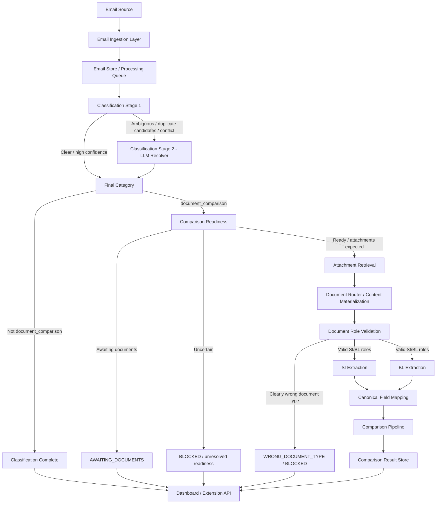

# Backend Requirements Specification

## Shipping Document Verification — Email Ingestion → Classification → Extraction → Comparison

**Document status:** Draft v4 — revised after a second dataset review. This revision tightens the boundary between `new_si_request` and `document_comparison / AWAITING_DOCUMENTS`, fixes cross-document enum consistency, and makes self-evaluation mapping explicit rather than implicit.

**Scope:** Backend only, from email ingestion up to comparison result.

**Explicitly out of scope for this version:** Human Review UI/workflow, reviewer actions, final presentation/report UI.

---

## 1. Purpose

Build a backend that automatically receives or loads shipping-operation emails, classifies every email, processes only document-comparison requests, extracts the required SI/BL shipment fields, compares them safely, and exposes the processing result to the Web Dashboard and Email Extension.

The backend should support both:

1. **Initial inbox backlog processing**
2. **Continuous processing of newly arrived emails**

Target production behavior:

> **“When deployed, the system first processes the existing inbox backlog, then continuously monitors for new incoming emails.”**

The hackathon/demo can use the provided email dataset as the initial inbox backlog, then simulate one or more new incoming emails to demonstrate continuous automatic processing.

> **Important:** The demo backlog size may be 520 emails, but the backend must never hard-code `520`. It must support `N` existing emails.

---

# 2. Source-Defined Functional Requirements

The challenge defines the following core behavior:

- Emails must be classified into: 
  - `document_comparison`
  - `new_si_request`
  - `invoice_query`
  - `general_message`
  - `spam`
- Only `document_comparison` emails continue into document checking.
- SI is the reference document.
- SI and draft BL must be compared.
- The comparison covers exactly seven required fields: 
  1. `shipper`
  2. `consignee`
  3. `notify_party`
  4. `port_of_loading`
  5. `port_of_discharge`
  6. `container_count`
  7. `gross_weight_kg`
- The system must recognize equivalent field labels, e.g.: 
  - `Port of Loading`
  - `Load Port`
- Advanced inputs may include: 
  - PDF
  - Word
  - scanned/image-only documents
  - tables
  - different page layouts
  - varied field labels
  - formatting differences
  - misleading email subjects
  - missing attachments
- The system should avoid false alarms caused only by formatting or reading differences.
- For evaluation, every email must have an output category; document-comparison emails also require mismatch information.

This specification adds engineering decisions around ingestion, staging, routing, caching, parallelism, and APIs. Those are **proposed architecture choices**, not challenge-mandated implementation details.


## 2.1 Dataset-Validated Requirements / Observations

Direct inspection of the provided sample/organizer bundle confirmed that the implementation must also handle:

- XLSX SI/BL attachments in addition to TXT/PDF/DOCX/scanned documents
- image-only PDFs with zero extractable text
- corrupted/truncated PDFs
- readable attachments whose content is the wrong business document type
- bilingual/descriptive labels such as `Shipper (Principal or Seller) (发货人)`
- contextual labels such as `To the Order of` for consignee-equivalent data in a negotiable B/L context
- compound container values such as `6 x 40'HC`
- numeric XLSX cells such as gross weight already typed as a number
- document-comparison emails that legitimately contain no attachments because the sender is requesting that a draft BL be sent for later checking

- `new_si_request` emails that also mention a future draft BL, but whose primary purpose is to create/submit a new SI and whose body already contains a dense SI field block

Therefore, these surface features are **not sufficient classification rules by themselves**:

```text
no attachments
mentions "draft BL"
```

Both `new_si_request` and `document_comparison / AWAITING_DOCUMENTS` can share them.

The classifier must resolve the **primary requested action** and the structure/content of the email body before assigning the final category.

The implementation must therefore distinguish:

```text
document_comparison intent
≠
documents are necessarily ready for comparison now
```

This distinction is handled by the **Comparison Readiness** stage defined below.

### Dataset-integrity rule

The organizer Docker distribution may contain private evaluation/reference files such as `ground_truth.json`.

**Runtime application code, prompts, dictionaries, caches, feature engineering, classification, extraction, comparison, or demo logic must never read or derive predictions from private ground-truth/reference answers.**

Private reference data may only be used by official evaluation/scoring tooling or by a separate offline audit performed by authorized developers. The participant-facing implementation must behave correctly from the email/document inputs alone.

---

# 3. High-Level Architecture



---

# 4. End-to-End Processing Workflow

## 4.1 First Deployment / Initial Sync

```text
📥 Initial Sync
Existing inbox emails
        ↓
Fetch email records
        ↓
Deduplicate / check processing state
        ↓
Process only unprocessed emails
        ↓
Classification
        ↓
Document comparison?
   ┌────┴────┐
   │         │
  No        Yes
   │         ↓
   │     SI / BL retrieval
   │         ↓
   │      Extraction
   │         ↓
   │       Compare
   │         ↓
   └────→ Persist result
             ↓
      Dashboard populated

```

### Requirements

- The first startup must support importing the full existing inbox/backlog.
- Each email must have a stable unique identifier.
- Already processed emails must not be processed again unless explicitly reprocessed.
- Initial sync should be batch/concurrency controlled rather than loading every email into memory at once.
- Dashboard data should become available progressively as emails complete; the system does not need to wait for the entire backlog before showing results.

---

## 4.2 Continuous Processing After Initial Sync

```text
📧 New Email
    ↓
Webhook / Polling / Ingestion API
    ↓
Create email record
    ↓
Process automatically
    ↓
Classification
    ↓
If document_comparison:
Check comparison readiness
    ↓
If ready:
Extract + Compare
    ↓
If awaiting documents:
Persist AWAITING_DOCUMENTS
    ↓
Persist result/state
    ↓
Notify Dashboard / Extension

```

### Preferred production order

1. **Webhook / push notification** where provider supports it
2. **Polling fallback**
3. **Manual/simulated ingestion endpoint** for hackathon demo/testing

### Polling fallback

Recommended prototype default:

- poll every **60 seconds**
- retrieve only messages newer than the last sync checkpoint
- never rescan the full mailbox every interval
- exponential backoff on provider/API failures

---

# 5. Email Source / Ingestion Layer

The backend must separate **email provider integration** from the AI/document pipeline.

All sources must be transformed into one common internal email format.

## 5.1 Required Source Adapters

### A. Dataset Adapter — required for challenge data

Support:

- static extracted dataset folder
- local Docker data server
- provided `loader.py`

This is the challenge-compatible input path.

### B. Simulated Incoming Email API — required for demo

Provide an endpoint such as:

```http
POST /api/v1/ingestion/email

```

Example conceptual payload:

```json
{
  "external_email_id": "demo-001",
  "sender": "customer@example.com",
  "recipients": ["shipping@example.com"],
  "subject": "Please verify draft BL",
  "body": "Please compare the attached SI and BL.",
  "received_at": "2026-09-20T10:30:00+08:00",
  "attachments": [
    {
      "filename": "SI.pdf",
      "content_type": "application/pdf",
      "content": "<binary-or-upload-reference>"
    },
    {
      "filename": "BL.pdf",
      "content_type": "application/pdf",
      "content": "<binary-or-upload-reference>"
    }
  ]
}

```

This endpoint is the recommended way to simulate:

> **“A new email just arrived.”**

during the demo.

### C. Microsoft Graph / Outlook Adapter — production integration path

Proposed future/production adapter:

```text
Outlook / Microsoft 365
        ↓
Microsoft Graph
        ↓
Email Ingestion Adapter
        ↓
Common Internal Email Model

```

The core pipeline must not depend directly on Microsoft Graph. Graph-specific logic must remain inside the adapter.

---

# 6. Common Internal Email Model

Every source must map into this structure before classification.

```json
{
  "email_id": "internal-uuid",
  "external_email_id": "provider-message-id",
  "source": "dataset | graph | simulated_api",
  "sender": "sender@example.com",
  "recipients": ["shipping@example.com"],
  "subject": "Please verify documents",
  "body_text": "Please compare the attached SI and BL.",
  "received_at": "2026-09-20T10:30:00+08:00",
  "attachments": [
    {
      "attachment_id": "att-001",
      "filename": "SI.pdf",
      "content_type": "application/pdf",
      "size_bytes": 123456,
      "storage_reference": "..."
    }
  ],
  "processing_status": "NEW"
}

```

### Requirements

- Keep original subject/body unchanged.
- Store attachment metadata before reading full attachment content.
- Attachment content should support lazy loading.
- Use provider message ID + source as an idempotency key where possible.
- Preserve received timestamp for ordering and audit.

---

# 7. Processing Status Model

Backend statuses up to the end of comparison:

```text
NEW
QUEUED
CLASSIFYING
CLASSIFIED
AWAITING_DOCUMENTS
RETRIEVING_ATTACHMENTS
EXTRACTING
COMPARING
COMPLETED
BLOCKED
FAILED

```

### Meaning

| Status Meaning           |                                                               |
| ------------------------ | ------------------------------------------------------------- |
| `NEW`                    | Email ingested but not queued                                 |
| `QUEUED`                 | Waiting for processing                                        |
| `CLASSIFYING`            | Classification pipeline running                               |
| `CLASSIFIED`             | Final email category decided                                  |
| `AWAITING_DOCUMENTS`      | Document-comparison intent is valid, but the current email is requesting/awaiting the draft documents rather than presenting a pair to compare now |
| `RETRIEVING_ATTACHMENTS` | Fetching comparison documents                                 |
| `EXTRACTING`             | SI/BL extraction running                                      |
| `COMPARING`              | Seven fields being compared                                   |
| `COMPLETED`              | Processing finished successfully                              |
| `BLOCKED`                | Backend cannot safely continue before the next workflow phase |
| `FAILED`                 | Technical processing failure                                  |

`BLOCKED` is only a backend state in this version. The Human Review workflow is intentionally not specified here.

---

# 8. Classification Requirements

## 8.1 Allowed Final Categories

Exactly one final category must be selected:

```text
document_comparison
new_si_request
invoice_query
general_message
spam

```

The internal Stage 1 may produce multiple candidate categories, but the final classification result must be single-label.

---

## 8.2 Classification Inputs

Stage 1 may use:

- subject
- body
- sender/context metadata where useful
- attachment metadata: 
  - filenames
  - content types
  - count

Full attachment parsing should **not** be mandatory for every email because non-comparison emails only require classification.

---

## 8.3 Stage 1 — Fast Candidate Classifier

Goal:

> Resolve obvious cases cheaply and quickly.

Stage 1 should return:

```json
{
  "candidates": [
    {
      "category": "document_comparison",
      "score": 0.91
    },
    {
      "category": "invoice_query",
      "score": 0.08
    }
  ],
  "conflict_detected": false,
  "stage1_confidence": 0.91
}

```

### Stage 1 may finalize when

- one category is strongly supported
- there is no major conflicting signal
- the top candidate is sufficiently separated from competing candidates
- required classification evidence is sufficient
- the `new_si_request` vs `document_comparison` boundary has been checked when the email has no attachments and mentions a future draft BL

Thresholds must be configurable.

### Critical collision: `new_si_request` vs `document_comparison / AWAITING_DOCUMENTS`

Do **not** classify from these two features alone:

```text
attachments = 0
body contains "draft BL"
```

They occur in both intents.

Resolve the primary action using the body structure and request semantics.

#### Stronger signals for `new_si_request`

Typical pattern:

- body contains a dense/structured SI information block
- several shipment fields are directly supplied in the email body, e.g.:
  - shipper
  - consignee
  - notify party
  - port of loading
  - port of discharge
  - container information
  - gross weight
- the sender is establishing/submitting shipping-instruction details now
- mention of a future draft BL is a follow-up step, not the current task

Example shape:

```text
Please find Shipping Instruction for <reference>.

Shipper: ...
Consignee: ...
Notify: ...
POL: ...
POD: ...
Container: ...
Gross Weight: ...

Please revert with draft BL once available.
```

This should resolve toward:

```text
final_category = new_si_request
```

The final sentence mentioning a future draft BL must not override the primary SI-creation/submission intent.

#### Stronger signals for `document_comparison`

Typical pattern:

- primary action is to obtain/check/verify a draft BL
- body does not contain a full SI creation block
- email may contain only an existing booking/reference number plus a request to send the draft BL for checking
- the current business process is document checking rather than creation of a new SI

Example shape:

```text
Please assist to send the draft BL for <booking/ref> for checking asap.
```

This should resolve toward:

```text
final_category = document_comparison
comparison_readiness = AWAITING_DOCUMENTS
```

#### Supporting signals only

Phrases such as:

```text
"asap"
"once available"
"for checking"
"revert with draft BL"
```

may help classification, but must remain supporting evidence rather than single hard-coded rules.

The most important discriminator is:

```text
What is the sender asking the operation team to do now?
```

followed by:

```text
Does the body already provide a structured SI field block?
```

Example:

```text
Top1 = 0.94
Top2 = 0.07
No conflict
→ finalize Stage 1

```

---

## 8.4 Stage 2 — LLM Ambiguity Resolver

Trigger Stage 2 only when Stage 1 detects:

- multiple plausible categories
- small score gap
- subject/body conflict
- misleading subject suspicion
- low confidence
- unclear/mixed intent

Stage 2 input should include:

- subject
- body
- attachment metadata
- Stage 1 candidate categories
- Stage 1 scores
- reason for escalation
- whether a structured SI field block appears in the body
- which canonical SI-like labels were detected in the body
- whether the body primarily asks to create/submit SI data, send a future draft BL, or compare/check documents now

For the `new_si_request` vs `document_comparison` collision, Stage 2 should reason about the **primary requested action**, not merely keywords such as `draft BL`.

Stage 2 must:

- choose only from the five supported categories
- produce exactly one final category
- return confidence
- return a short machine-readable reason
- avoid inventing new categories

Example output:

```json
{
  "final_category": "document_comparison",
  "confidence": 0.94,
  "reason_code": "BODY_EXPLICIT_COMPARE_REQUEST",
  "reason": "Body explicitly requests SI vs BL comparison; subject is misleading."
}

```

---

## 8.5 Classification Routing

```text
final_category != document_comparison
→ persist classification
→ COMPLETED

final_category == document_comparison
→ continue to Comparison Readiness

```


## 8.6 Comparison Readiness

A final category of `document_comparison` does **not** automatically mean the current email is ready for SI/BL extraction.


**Important boundary:** Comparison Readiness runs **only after** classification has already resolved the email to `document_comparison`.

It must not be used as a shortcut to absorb ambiguous `new_si_request` emails.

In particular:

```text
new_si_request
+ no attachments
+ "please revert with draft BL once available"
```

remains `new_si_request`; it does not become `AWAITING_DOCUMENTS`.

`AWAITING_DOCUMENTS` is a sub-state of the document-comparison workflow, not a sixth classification category and not a fallback for every no-attachment email mentioning a draft BL.

The backend must determine the operational sub-state:

```text
document_comparison
        ↓
Comparison Readiness
        ↓
┌──────────────────────┬──────────────────────────┬──────────────────┐
│ READY_FOR_COMPARISON │ AWAITING_DOCUMENTS       │ UNRESOLVED       │
└──────────────────────┴──────────────────────────┴──────────────────┘
```

### `READY_FOR_COMPARISON`

Use when the sender is asking for a current SI/BL pair to be checked, verified, confirmed, or compared, and the message context indicates the comparison documents are expected now.

Examples of intent:

```text
"Please compare the attached SI and draft BL."
"Attached are the SI and draft BL. Please check the details."
"Please check the draft BL against the SI."
```

Then:

```text
READY_FOR_COMPARISON
→ validate required attachments
→ retrieve documents
→ extract
→ compare
```

If required documents are expected now but are actually missing, this is a true `MISSING_REQUIRED_ATTACHMENT` / `BLOCKED` condition.

### `AWAITING_DOCUMENTS`

Use when the email belongs to the document-comparison business process but is asking another party to **send/provide the draft BL or documents for later checking**, rather than asking the system to compare a pair that should already be attached.

Example intent:

```text
"Please assist to send the draft BL for ... for checking asap."
```

This is **not** a missing-attachment error.

The backend should:

```text
category = document_comparison
comparison_readiness = AWAITING_DOCUMENTS
processing_status = AWAITING_DOCUMENTS
```

and stop before attachment extraction.

Do not send such cases to extraction merely because the final category is `document_comparison`.

### `UNRESOLVED`

Use when the backend cannot determine whether the email is:

- requesting documents for future comparison, or
- requesting an immediate comparison with missing documents

Do not guess. Persist the unresolved readiness state for the next workflow phase.

### Implementation guidance

Comparison readiness should primarily use the sender's requested action in the body, with subject and attachment presence as supporting evidence.

Before entering this stage, classification must already have ruled out `new_si_request`.

Recommended evidence passed from classification into readiness:

```text
primary_intent
si_field_block_detected
detected_si_labels[]
attachment_count
attachment_roles_if_known
future_draft_bl_language
immediate_compare_language
```

Absence of attachments **alone** is insufficient to classify a case as `missing_attachment`.

Likewise, presence of the phrase `draft BL` is insufficient to decide either category or readiness state.

---

# 9. Attachment Retrieval Requirements

Attachment content should only be fully retrieved when necessary.

For `document_comparison` where `comparison_readiness = READY_FOR_COMPARISON`:

1. retrieve comparison attachments
2. identify candidate SI and BL documents
3. persist attachment content or secure storage references
4. calculate a file hash for cache/deduplication
5. route documents to the correct extractor

Possible backend outcomes at this stage:

```text
SI_FOUND
BL_FOUND
MULTIPLE_CANDIDATES
MISSING_REQUIRED_ATTACHMENT
UNSUPPORTED_ATTACHMENT
CORRUPTED_ATTACHMENT
WRONG_DOCUMENT_TYPE

```

`WRONG_DOCUMENT_TYPE` covers an attachment that is readable and correctly formatted, but whose content is not the SI/BL role required for the comparison (e.g. a commercial invoice or certificate of origin sent under an SI/BL filename). This cannot be detected from filename or content-type alone — see §11.5 for the content-based check that produces this outcome. It is surfaced here as an attachment-retrieval-stage outcome because it blocks the same downstream steps as a missing attachment.

This version stops blocked cases at `BLOCKED`; Human Review behavior is out of scope.

---

# 10. Document Router

Before field extraction, determine how each attachment should be materialized into readable content.

```text
Attachment
   ↓
Detect format / readability
   ↓
┌─────────────────────────────┐
│ Plain text                  │ → Direct text reader
│ Text-based PDF              │ → PDF text extraction
│ DOCX                        │ → DOCX parser (paragraphs + tables)
│ XLSX                        │ → XLSX key-value / table reader
│ Scanned / image-only PDF    │ → OCR / Vision
│ Image                       │ → OCR / Vision
└─────────────────────────────┘

```

### XLSX reader notes

SI/BL delivered as XLSX are typically a two-column key-value sheet (label in column A, value in column B) rather than a row-per-record table. The reader should:

- iterate rows rather than assume a fixed header row, since layout varies by sender
- treat numeric cells (e.g. gross weight) as already-typed numbers, not strings — do not re-parse a number XLSX gives natively, but still run it through the same L0/L1 normalization as text-sourced values so comparison logic stays uniform across formats
- fall back to the same label dictionary used for DOCX/PDF/text column-A text, since the same label variants (`GROSS WEIGHT`, `Port of Loading (POL)`, etc.) appear here too

### Performance requirement

Do not intentionally run a method that is known to be unsuitable first.

Example:

```text
Image-only scanned PDF
→ detect no machine-readable text
→ directly route to OCR/Vision

```

rather than:

```text
PDF parser
→ fail
→ retry another parser
→ fail
→ OCR

```

---

# 11. Extraction Requirements

## 11.1 Scope

Extraction runs only for document-comparison requests.

Each SI and BL must produce the seven required shipment fields:

```text
shipper
consignee
notify_party
port_of_loading
port_of_discharge
container_count
gross_weight_kg

```

---

## 11.2 Parallel Document Extraction

SI and BL should be processed concurrently where infrastructure permits.

```text
           ┌── SI → extractor ──┐
Email ─────┤                    ├── extraction results
           └── BL → extractor ──┘

```

Do not wait for SI extraction to finish before starting BL extraction unless the selected extractor requires sequential processing.

---

## 11.3 One-Pass Field Extraction

Do **not** perform seven independent expensive LLM calls per document.

Preferred:

```text
1 document
→ 1 extraction pass
→ all 7 fields

```

Example extraction output:

```json
{
  "document_role": "SI",
  "fields": {
    "shipper": {
      "raw_label": "SHIPPER",
      "raw_value": "ABC Logistics Sdn. Bhd.",
      "confidence": 0.99,
      "source": {
        "page": 1,
        "text_span": "SHIPPER: ABC Logistics Sdn. Bhd."
      }
    },
    "container_count": {
      "raw_label": "CONTAINERS",
      "raw_value": "3",
      "confidence": 0.99,
      "source": {
        "page": 1,
        "text_span": "CONTAINERS: 3"
      }
    }
  }
}

```

### Preserve raw values

Never destroy the source/raw extracted value.

Comparison can use normalized values internally, but the original extracted text must remain available.

---

## 11.4 Extraction Fallback / Stage 2

The extraction layer may also use a staged strategy:

### Fast path

- deterministic parser
- text extraction
- label dictionary
- regex
- structured table extraction

### Advanced fallback

Use LLM/Vision only when required, e.g.:

- unusual layout
- scanned document
- multiple candidate values
- unknown field label
- low extraction confidence

The fallback should process only the unresolved document/fields where practical rather than re-running everything unnecessarily.

---

## 11.5 Document Type Validation

An attachment can be fully readable and still not be the document it claims to be — e.g. a file named `*_BL.txt` whose content is actually a commercial invoice or certificate of origin. This must be caught before field extraction is trusted, otherwise the pipeline silently extracts whatever fields happen to be present and produces a meaningless comparison instead of a real mismatch.

Run this check immediately after **readable document content** is available — whether represented as text, DOCX/PDF text, XLSX cells/tables, or OCR/Vision output — and before canonical field mapping or extracted fields are trusted:

```text
Readable document content
        ↓
Does it contain the expected document markers for its claimed role (SI / BL)?
   ┌────┴────┐
  Yes        No
   │           ↓
   │      WRONG_DOCUMENT_TYPE → BLOCKED
   ↓
Continue to canonical field mapping

```

Detection should be a cheap, deterministic check, not an LLM call:

- presence of a document-type header/title (`SHIPPING INSTRUCTION`, `BILL OF LADING`, `B/L INSTRUCTION`, etc.) vs. a conflicting one (`COMMERCIAL INVOICE`, `CERTIFICATE OF ORIGIN`)
- density of expected SI/BL field labels (shipper/consignee/port/container/weight-style labels) vs. unrelated labels (`Invoice No.`, `Buyer`, `Seller`, `Total Amount`, `Issuing Authority`)
- an explicit self-declaring line in the source document, when present, is a strong signal and should short-circuit the check

If the check is inconclusive rather than clearly wrong, do not force `WRONG_DOCUMENT_TYPE` — fall through to normal extraction and let per-field confidence/`UNRESOLVED` handle the uncertainty instead.

---

# 12. Canonical Field Mapping

Before value comparison, raw document labels must be mapped to canonical variables.

Example dictionary:

```text
Port of Loading
Load Port
Loading Port
POL
        ↓
port_of_loading

```

```text
Port of Discharge
Discharge Port
POD
        ↓
port_of_discharge

```

The mapping dictionary must be configurable and extendable.


## 12.1 Label Pre-Normalization

Before dictionary lookup, normalize labels conservatively while preserving the original `raw_label`.

Supported operations may include:

- case normalization
- whitespace normalization
- Unicode normalization
- removal of recognized descriptive/translation annotations when they are not part of the canonical meaning
- retention of recognized shipping abbreviations/codes such as `POL` and `POD`

Examples:

```text
Shipper (Principal or Seller) (发货人)
→ shipper

Consignee (收货人)
→ consignee

Port of Loading (POL) (装货港)
→ port_of_loading

Gross Wt (kgs) (毛重 KGS)
→ gross_weight_kg
```

Do not blindly strip every parenthesized token. Some parenthesized values are meaningful shipping abbreviations/codes.

## 12.2 Contextual Business Mapping

Some source labels are not simple text aliases and require business context.

### `To the Order of` → consignee-equivalent

For the provided benchmark/business context, `To the Order of` is a supported consignee-equivalent label on negotiable Bills of Lading.

When it appears in the relevant consignee/order section:

```text
raw_label = "To the Order of"
canonical_field = "consignee"
mapping_method = "negotiable_bl_consignee_equivalent"
```

Preserve the raw label and value.

Do not generalize arbitrary occurrences of the word `order` to `consignee`.

### Mapping provenance

Each mapped field should record how the mapping was obtained where practical:

```text
exact_label
alias_dictionary
bilingual_label_normalization
contextual_business_rule
table_structure
llm_resolved
```

This provenance is useful for debugging, reliability checks, and later Human Review.

### Required canonical schema

```json
{
  "shipper": null,
  "consignee": null,
  "notify_party": null,
  "port_of_loading": null,
  "port_of_discharge": null,
  "container_count": null,
  "gross_weight_kg": null
}

```

---

# 13. Comparison Requirements

## 13.1 Comparison Principle

SI is the reference.

For every canonical field:

```text
SI value
vs
BL value

```

The system must identify:

```text
MATCH
MISMATCH
UNRESOLVED

```

`UNRESOLVED` is a backend outcome for cases that cannot be safely decided before the next workflow phase.

---

# 14. Comparison Strategy — Performance + Accuracy

Do not apply expensive semantic normalization to every value.

Use a layered approach.

```text
Canonical field mapping
        ↓
L0 Safe Normalization
        ↓
Fast Compare
   ┌────┴────┐
 MATCH     NOT MATCH
   │           ↓
   │       L1 Field-Specific Normalization
   │           ↓
   │       Compare again
   │       ┌───┴────┐
   │      MATCH   STILL DIFFERENT
   │        │         ↓
   │        │      L2 Semantic Resolution
   │        │         ↓
   └────────┴──→ Final field result

```

---

## 14.1 L0 — Universal Safe Normalization

Apply to all seven fields because it is cheap and low-risk.

Allowed examples:

- trim leading/trailing whitespace
- collapse repeated whitespace
- standardize case for comparison
- Unicode normalization
- standardize obvious line-break artifacts

L0 must not remove meaningful words.

---

## 14.2 Fast Comparison

After L0:

```text
if SI_L0 == BL_L0:
    MATCH
else:
    continue to L1

```

Only values that fail fast comparison continue deeper.

---

## 14.3 L1 — Field-Specific Normalization

### `container_count`

Real SI/BL values are frequently compound — a count plus a container size/type — not a bare number:

```text
"03" → 3
"3 containers" → 3
"6 x 40'HC" → count = 6, type = "40'HC"
"15 x 20'GP" → count = 15, type = "20'GP"
"12 x 20'FCL" → count = 12, type = "20'FCL"

```

`container_count` as a canonical field is the **count only**. The container size/type is not one of the seven required comparison fields, so it must be parsed out and set aside, not carried into the comparison — a size/type difference alone (e.g. `40'HC` vs `40'GP` with the same count) is not a `container_count` mismatch and must not be compared or reported as one. If the parser cannot confidently split count from type (unfamiliar format), do not guess — leave the field `UNRESOLVED` rather than infer a number.

### `gross_weight_kg`

Safe examples:

```text
"22,000 KG" → 22000
"22000 kg" → 22000

```

If other units are supported, unit conversion must be explicit and deterministic.

Documents may also contain a similarly-labeled but different field — most commonly `NET WEIGHT` alongside `GROSS WEIGHT`. Canonical field mapping (§12) must map only gross-weight labels to `gross_weight_kg`; a net-weight label must never be treated as an unmapped variant of gross weight, even when it is the only weight-like label present on a given document (that case should surface as a missing/unresolved value, not a silent substitution).

### Port fields

Safe normalization may include:

- case
- whitespace
- approved alias dictionary
- approved port-code mapping

Do not automatically treat semantically similar but unverified port names as equivalent.

### Shipper / Consignee / Notify Party

Use conservative normalization.

Safe examples may include:

- case
- whitespace
- punctuation differences that do not change entity identity

Do not aggressively delete meaningful company/entity terms.

---

# 15. L2 — Semantic Resolution

Only run when:

```text
L0 mismatch
AND
L1 mismatch
AND
the difference may plausibly be formatting/semantic equivalence

```

Examples:

```text
ABC Logistics Sdn. Bhd.
vs
ABC Logistics Sdn Bhd

```

or a recognized shipping abbreviation that requires context.

L2 must return:

```json
{
  "equivalent": true,
  "confidence": 0.93,
  "reason": "Only punctuation/legal formatting differs."
}

```

If equivalence cannot be determined safely:

```text
UNRESOLVED

```

Do not force `MATCH`.

---

# 16. Comparison Output Model

Example:

```json
{
  "email_id": "E001",
  "category": "document_comparison",
  "comparison_status": "COMPLETED",
  "mismatch_found": true,
  "fields": {
    "shipper": {
      "status": "MATCH",
      "si_raw": "ABC Logistics Sdn. Bhd.",
      "bl_raw": "ABC Logistics Sdn Bhd"
    },
    "container_count": {
      "status": "MISMATCH",
      "si_raw": "3",
      "bl_raw": "4",
      "si_normalized": 3,
      "bl_normalized": 4
    },
    "gross_weight_kg": {
      "status": "MATCH",
      "si_raw": "22,000 KG",
      "bl_raw": "22000 kg",
      "si_normalized": 22000,
      "bl_normalized": 22000
    }
  },
  "mismatched_fields": [
    "container_count"
  ]
}

```

If all seven fields match:

```json
{
  "mismatch_found": false,
  "mismatched_fields": [],
  "message": "No mismatch detected."
}

```

---

# 17. Performance Requirements

## 17.1 Process only what is necessary

```text
All emails
→ classification

Only document_comparison
→ comparison readiness

Only READY_FOR_COMPARISON
→ attachment retrieval + extraction + comparison

```

Do not run document OCR/extraction on spam, invoice queries, general messages, or new-SI requests.

---

## 17.2 Lazy attachment loading

Initial classification should normally use:

- subject
- body
- attachment metadata

Full attachment content should be retrieved only when the workflow requires it.

---

## 17.3 Parallel SI / BL processing

SI and BL extraction should run concurrently.

---

## 17.4 Batch field extraction

Extract all seven fields in one document pass rather than seven expensive calls.

---

## 17.5 Escalate only difficult cases

Stage 2 LLM/semantic processing should only receive:

- ambiguous classification cases
- complex extraction cases
- unresolved comparisons

Easy cases must stay on the fast path.

---

## 17.6 Cache extraction results

Generate a document hash, e.g.:

```text
SHA-256(file bytes)

```

Cache:

```text
file_hash
→ document extraction result

```

If the same exact document is encountered again, reuse the extraction result where valid.

---

## 17.7 Idempotent email processing

Processing the same provider email twice must not create duplicate cases.

Use:

```text
source + external_email_id

```

as a uniqueness constraint where possible.

---

## 17.8 Controlled concurrency for initial backlog

Initial sync must not trigger unlimited parallel AI/OCR calls.

Configuration examples:

```text
classification_workers = configurable
extraction_workers = configurable
llm_concurrency_limit = configurable
ocr_concurrency_limit = configurable

```

---

# 18. Dashboard / Extension Backend Interfaces

This section defines only backend data interfaces, not UI.

## 18.1 List emails/cases

```http
GET /api/v1/emails

```

Filters may include:

```text
status
category
received_from
received_to
has_mismatch

```

---

## 18.2 Get one email processing result

```http
GET /api/v1/emails/{email_id}

```

Return:

- email metadata
- classification
- processing status
- attachment metadata
- extraction result when applicable
- comparison result when applicable

---

## 18.3 Initial sync

```http
POST /api/v1/sync/initial

```

Responsibilities:

- fetch backlog
- deduplicate
- queue unprocessed emails
- return sync job ID

---

## 18.4 Simulate/receive new email

```http
POST /api/v1/ingestion/email

```

Used for demo and generic inbound integration.

---

## 18.5 Reprocess technical failure

Optional backend endpoint:

```http
POST /api/v1/emails/{email_id}/reprocess

```

This is a processing control only; Human Review actions are out of scope.

---

# 19. Real-Time Dashboard Update Channel

When processing status changes, backend should publish an event.

Possible implementation:

- Server-Sent Events
- WebSocket
- lightweight frontend polling

Example event:

```json
{
  "event": "EMAIL_PROCESSING_UPDATED",
  "email_id": "E001",
  "status": "COMPLETED",
  "category": "document_comparison",
  "mismatch_found": true,
  "updated_at": "2026-09-20T10:32:10+08:00"
}

```

This allows the dashboard to update automatically after:

- initial sync
- a new incoming email
- classification completion
- extraction completion
- comparison completion

---

# 20. Persistence / Suggested Data Entities

Minimum suggested backend entities:

```text
EmailRecord
AttachmentRecord
ClassificationResult
DocumentExtractionResult
FieldExtractionResult
ComparisonResult
ProcessingEvent

```

Suggested relations:

```text
EmailRecord
  ├── AttachmentRecord[]
  ├── ClassificationResult
  └── ComparisonResult
         ├── SI Extraction
         └── BL Extraction

```

---

# 21. Failure Handling Before Human Review

This specification stops before Human Review, but the backend must still preserve unresolved/failed states.

### `FAILED`

Use for technical errors such as:

- parser crash
- OCR/API failure
- timeout
- storage/read failure
- malformed model response

### `BLOCKED`

Use when processing cannot safely continue, e.g.:

- required attachment unavailable
- extraction unresolved
- comparison unresolved

The next specification can define how `BLOCKED` cases enter Human Review.

---

# 22. Optional Self-Evaluation Adapter

For challenge development, provide an adapter that can convert internal results into the required submission shape.

Requirements:

- include every email
- use `email_id` as the key
- include category for all emails
- for document-comparison emails include: 
  - mismatch status
  - mismatched fields
- match `sample_submission.json`
- support submitting via the provided local server/loader

The internal backend model should **not** be constrained by the self-evaluation JSON format.

### Explicit internal → submission mapping

The self-evaluation adapter must own an explicit mapping from internal concepts to the participant submission schema.

At minimum, verify the participant-facing enums from the public `sample_submission.json` / allowed self-evaluation interface before implementation.

Do not assume that internal workflow states have one-to-one equivalents in the official schema.

In particular:

```text
AWAITING_DOCUMENTS
```

is an internal operational state. If the official submission schema does not expose an equivalent field/value, the adapter must deliberately map it to an allowed submission representation **only after that mapping has been validated through the permitted public/sample schema and self-evaluation interface**.

Do **not** guess or hard-code:

```text
AWAITING_DOCUMENTS → NEEDS_REVIEW + missing_attachment
```

unless the permitted evaluation interface/documentation confirms that mapping.

Keep the internal state semantically correct even if the submission adapter must compress it into a smaller official enum set.

The application must not read private evaluator/reference answers such as `ground_truth.json` to produce predictions. Evaluation data is strictly separated from runtime inference.

---

# 23. Demo Scenario

## Demo Part A — Existing Inbox

```text
Start backend
    ↓
Initial Sync
    ↓
Load provided existing-email dataset
    ↓
Only unprocessed emails queued
    ↓
Dashboard fills progressively

```

Narration:

> **“When deployed, the system first processes the existing inbox backlog, then continuously monitors for new incoming emails.”**

---

## Demo Part B — New Incoming Email

```text
System already running
        ↓
POST simulated new email
or trigger mailbox event
        ↓
Backend detects new email
        ↓
Automatic classification
        ↓
If document_comparison:
Comparison readiness
   ├─ AWAITING_DOCUMENTS → persist state
   └─ READY_FOR_COMPARISON
            ↓
       SI + BL extraction
            ↓
       Comparison
        ↓
Dashboard updates automatically

```

No `Upload JSON → Run` flow should be required for the main demo.

---

# 24. Acceptance Criteria

## Ingestion

- [ ] Existing backlog can be loaded automatically.
- [ ] Already processed emails are not duplicated.
- [ ] New emails can be ingested automatically.
- [ ] Demo can simulate a new email without manual JSON upload into the UI.
- [ ] Dashboard receives processing updates.

## Classification

- [ ] Every email receives exactly one final category.
- [ ] Supported categories are exactly the five required categories.
- [ ] Non-document-comparison emails stop after classification.
- [ ] Obvious emails can complete at Stage 1.
- [ ] Ambiguous/conflicting emails can be resolved at Stage 2.
- [ ] `document_comparison` emails are further evaluated for comparison readiness.
- [ ] `new_si_request` emails with a structured SI body and a future `draft BL` follow-up are not absorbed into `AWAITING_DOCUMENTS`.
- [ ] `attachments = 0` + `draft BL` keyword is never used as a standalone category rule.
- [ ] A legitimate request to send/provide a draft BL is not misclassified as `missing_attachment` merely because it has no attachment.
- [ ] Immediate comparison requests with expected-but-missing documents are distinguishable from `AWAITING_DOCUMENTS`.

## Extraction

- [ ] SI and BL can be retrieved for document-comparison emails.
- [ ] Document type/readability is detected before extraction.
- [ ] Plain text is supported.
- [ ] PDF/Word architecture is supported.
- [ ] XLSX (key-value sheet) is supported.
- [ ] Scanned-document OCR/Vision path is supported.
- [ ] SI and BL extraction can run in parallel.
- [ ] All seven required fields are extracted in one pass per document where practical.
- [ ] Raw extracted values are preserved.
- [ ] A readable attachment whose content does not match its claimed SI/BL role is detected as `WRONG_DOCUMENT_TYPE` before field extraction is trusted.

## Comparison

- [ ] Different field labels can map to the same canonical field.
- [ ] Bilingual/descriptive labels can be normalized without discarding the raw label.
- [ ] `To the Order of` is supported as a contextual consignee-equivalent label in the relevant negotiable-B/L context.
- [ ] All seven fields are compared.
- [ ] SI is treated as reference.
- [ ] Safe normalization prevents obvious formatting false alarms.
- [ ] Expensive normalization is only applied to values that fail earlier comparisons.
- [ ] Field-specific normalization is used instead of one aggressive generic rule.
- [ ] `container_count` compound values (e.g. `6 x 40'HC`) are parsed into a count without leaking container size/type into the comparison.
- [ ] `gross_weight_kg` mapping never substitutes a `NET WEIGHT` (or other non-gross weight) label when no gross-weight label is present.
- [ ] True mismatch returns SI and BL values side-by-side.
- [ ] All seven matches produce `No mismatch detected.`
- [ ] Uncertain comparisons can remain `UNRESOLVED` rather than being forced into MATCH/MISMATCH.

## Performance / Reliability

- [ ] Attachment content is lazily loaded.
- [ ] Non-comparison emails do not run extraction.
- [ ] SI/BL extraction can be parallelized.
- [ ] Expensive LLM/OCR use is gated.
- [ ] Duplicate documents can reuse cached extraction.
- [ ] Backlog processing uses controlled concurrency.
- [ ] Technical failures are persisted as `FAILED`.
- [ ] Cases that cannot safely continue are persisted as `BLOCKED`.
- [ ] Legitimate document-comparison requests that are waiting for a future draft/document pair can be persisted as `AWAITING_DOCUMENTS` rather than `BLOCKED`.
- [ ] Runtime code never reads private `ground_truth.json` / reference answers to generate predictions.
- [ ] Internal `AWAITING_DOCUMENTS` has an explicit, separately tested submission-adapter mapping; the mapping is not guessed from hidden reference data.

---

# 25. Explicitly Out of Scope for This File

The following will be defined in the next backend/UI requirement document:

- Human Review queue
- review priority
- reviewer assignment
- confirm/correct actions
- retry from review UI
- source-evidence review UI
- Web Dashboard Human Review screens
- Email Extension Human Review screens
- synchronization of review actions between Dashboard and Extension
- reviewer audit trail
- final discrepancy-report presentation UI

This file intentionally ends at the backend comparison result.

Private organizer reference answers/scoring internals are also outside runtime application logic and must remain isolated from the production/demo inference path.